# About

`magnetovis` is a set of Python scripts that display magnetosphere-related objects, regions, and data in [ParaView](https://www.paraview.org/) that was initially developed under NASA Grant Number 80NSSC21K0305.

The objects created by `magnetovis` scripts are displayed in the `ParaView` GUI where the can be inspected, manipulated, and modified.

See the demo files in https://github.com/rweigel/magnetovis for example usage.

# Install

An existing installation of [ParaView 5.9+](https://www.paraview.org/download/) is required. 

ParaView includes a Python 3 version. Because `magnetovis` requires packages that are not distributed with ParaView, you should execute `magnetovis` in a enviroment with the same Python version number as that used by ParaView.

Installation has been only tested in OS-X and Linux. 

Please provide feedback by submitting an [issue](https://github.com/rweigel/magnetovis/issues).

```
git clone https://github.com/rweigel/magnetovis
cd magnetovis
pip install --editable .
magnetovis --script=magnetovis_demo.py
```

# Getting started

`magnetovis` has three distinct parts

1. A collection of Programmable Sources, Filters and Plugins that create and filter Heliophyiscs-related objects. See the [demos](#demos) for a full list and example usage. Most Magnetovis programmable sources (and their associated Plugins) have a set of default display options that are applied automatically when they are created. In Paraview, when a source is added to the pipeline, no display options are set and the user must select the options in the GUI or write a script that sets the options. `magnetovis` objects have default display options that are applied when the object is added to the pipeline.
2. A collection of helper functions for reducing the amount of code needed to modify view properties, the camera, and color bars. See the files starting with "Set" in [the ParaView directory](#).
3. A collection of helper functions for reducing the amount of code needed for creating programmable sources and filters. The functions are in the `vtk` folder.

# Approach

The objects (e.g, Earth, Plasmapause, etc.) in `magnetovis` are created using `ParaView` [`Programmable Sources`](https://docs.paraview.org/en/latest/ReferenceManual/pythonProgrammableFilter.html). Programmable Sources are short Python scripts that create [`VTK`](https://vtk.org) objects.

When a a `magnetovis` Programmable Source is created in a Macro or one the Python command line in Paraview, the user can see and modify the script that created the object. Each Programmable Source in the [Sources](https://github.com/rweigel/magnetovis/tree/main/magnetovis/Sources) directory has a corresponding `Plugin` that is automatically created from the Programmable Source file at startup.

The objects were developed using the ParaView GUI and the [Programmable Source editor](https://docs.paraview.org/en/latest/ReferenceManual/pythonProgrammableFilter.html#recipes-for-programmable-source). The final scripts are then placed in a file in the [Sources](https://github.com/rweigel/magnetovis/tree/main/magnetovis/Sources) directory. Each file in this directory is associated with a object and the code that is used to genereate the object is in a function called `Script()`.

%To demonstrate the general procedure by which magnetovis object are created, we will use the [Helix](https://docs.paraview.org/en/latest/ReferenceManual/pythonProgrammableFilter.html#helix-source) example from the ParaView user's guide.

%Magnetovis objects are listed in the ParaView `Sources` drop-down menu. 

%Selection of these sources creates an unstyled object that can be modified using the `Display (GeometryRepresentation)` menu in the `Properties` window.

%In `magnetovis`, each Programmable Source object has an associated script that adds attributes to the display object such as colors and annotations. To apply these attributes, execute a `Macro` associated with the Programmable Source.

# Development Notes

## Terminology

**ParaView**

* Proxy
* Plugin
* Source (Sometime used for filter, e.g, GetActiveSource() can return a filter)
* Filter
* Display/Representation
* View - types include _Render View_, ...
* Pipeline
* Transfer function/lookup table
* Camera

**Magnetovis**

* Presentation


## Testing and Developing Scripts

ParaView has a script and macro editor. However, the editor is basic and limited. To test scripts created using a different editor, enter the following on the Python Shell command line.

```python
import magnetovis; magnetovis.ClearPipeline() # Optional
exec(open("/absolute/path/to/script.py").read())
```

## Testing and Developing Programmable Sources

On start-up, `magnetovis` creates Programmable Sources based on the files in `magnetovis/Sources`. To create and test your own `magnetovis` programmable source, start with the following template

`/tmp/MySource.py`

```python
def MySource(**kwargs):
  import magnetovis
  return magnetovis.CreateProgrammableSource('/tmp/MySource.py')

def OutputDataSetType():

  # What is set in the drop-down menu for Output Data Set Type for
  # Programmable Source.
  return "vtkPolyData"

def Script(point1=0.0, point2=1.0, resolution=10):

  # What entered into the Script text area for a Programmable Source

  vtkLineSource = vtk.vtkLineSource()
  vtkLineSource.SetPoint1(point1)
  vtkLineSource.SetPoint2(point2)
  vtkLineSource.SetResolution(resolution)
  vtkLineSource.Update()

  output.ShallowCopy(vtkLineSource.GetOutputDataObject(0))

```

To use the source, enter the following in a script or on the Python Shell command line

```python
exec(open("/tmp/MySource.py").read())
source = MySource()
```

After entering the above command, you should see `MySource` in the ParaView pipeline and the content of `Script` will be the in the script text area under the `Properties` tab. Modifications to your source can be tested by either executing the above two commands in the ParaView Python Shell or by modifying the content of `Script` in the ParaView GUI.

# Notes

See `docs/Satellite_Region_Notes.md` for documentation on how magnetosphere regions were computed and a comparison with regions reported by SSCWeb.

# Demos

The demos can be run using

```
git clone https://github.com/rweigel/magnetovis
magnetovis magnetovis/Sources/FILENAME
```

where `FILENAME` is the name of a demo file listed below, e.g., `Axis_demo.py`.

<!-- Demos Start -->
## Arc
Source file: [Arc.py](https://github.com/rweigel/magnetovis/tree/main/magnetovis/Sources/Arc.py) | Demo file: [Arc_demo.py](https://github.com/rweigel/magnetovis/tree/main/magnetovis/Sources/Arc_demo.py)

### Demo 1

```python
import paraview.simple as pvs
import magnetovis as mvs
arc = mvs.Arc()
tube = pvs.Tube(arc)
pvs.Show(tube)
```


### Demo 2

```python
import paraview.simple as pvs
import magnetovis as mvs
mvs.CreateViewAndLayout()
mvs.Earth(coord_sys="GEO", coord_sys_view="GEO")
arc = mvs.Arc(Radisus=1.01, Direction=[0, 1, 0], StartPhi=-90, EndPhi=90)

color = [1.0, 0.0, 0.0]
tube = pvs.Tube(arc)
pvs.Show(tube, DiffuseColor=color)

text = pvs.Text(Text='Prime Meridian')
pvs.Show(text, TextPropMode='Billboard 3D Text', BillboardPosition=[0, 0, 1.05], Color=[1.0, 0.0, 0.0])
```

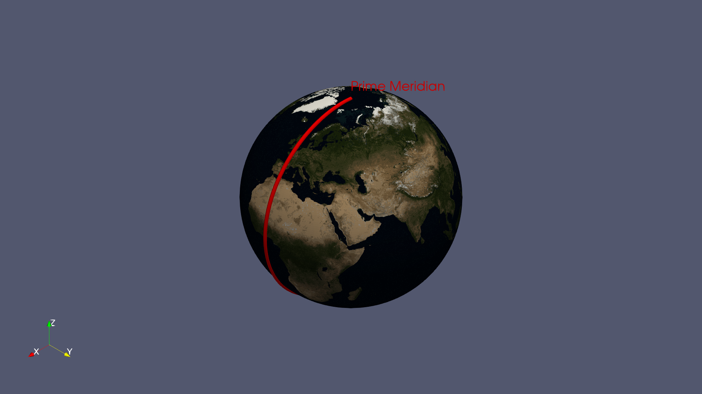

## Axis
Source file: [Axis.py](https://github.com/rweigel/magnetovis/tree/main/magnetovis/Sources/Axis.py) | Demo file: [Axis_demo.py](https://github.com/rweigel/magnetovis/tree/main/magnetovis/Sources/Axis_demo.py)

### Demo 1

```python
import magnetovis as mvs
mvs.Axis()
#mvs.PrintSourceDefaults('Axis')
mvs.SetTitle("Axis with default options")
#mvs.PrintPresentationDefaults('Axis', all=True)
```

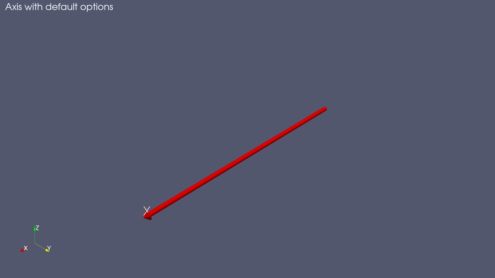

### Demo 2

```python
import magnetovis as mvs
mvs.CreateViewAndLayout()

skwargs = {
            "time": "2001-01-01",
            "coord_sys": "GSM",
            "tube": True,
            "tubeAndCone": True,
            "tubeFilterSettings": ["Radius: 0.5", "Capping: 1"]
        }

dkwargs = {
            "display": {
                "Representation": "Surface",
                "Opacity": 1.0,
                "AmbientColor": [1, 1, 0],
                "DiffuseColor": [1, 1, 0],
                "Visibility": 1
            },

            "label":
                {
                    "source": {"Text": r"$\alpha^2$/β"},
                    "display": {
                        "FontSize": 24,
                        "Color": [1, 1, 0]
                    }
                }
        }


skwargs['direction'] = "X"
skwargs['extent'] = [-40, 40]
xAxis = mvs.Axis()

skwargs['direction'] = "Y"
skwargs['extent'] = [-40, 40]
yAxis = mvs.Axis(registrationName="s^2/β Axis", **skwargs)
mvs.SetPresentationProperties(source=yAxis, **dkwargs)
mvs.SetTitle("Three Axes")

skwargs['direction'] = "Z"
skwargs['extent'] = [-40, 40]
zAxis = mvs.Axis(**skwargs)
```

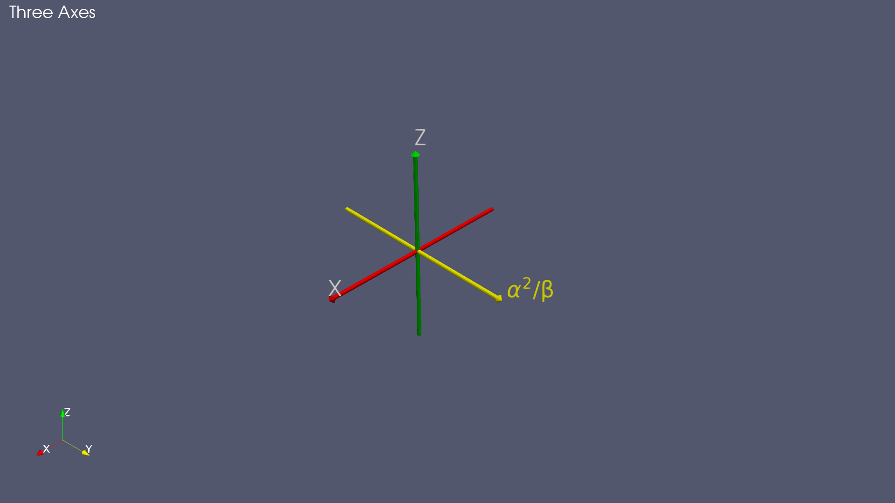

## Bowshock
Source file: [Bowshock.py](https://github.com/rweigel/magnetovis/tree/main/magnetovis/Sources/Bowshock.py) | Demo file: [Bowshock_demo.py](https://github.com/rweigel/magnetovis/tree/main/magnetovis/Sources/Bowshock_demo.py)

### Demo 1

```python
import magnetovis as mvs
bowshock = mvs.Bowshock()
```


## Circle
Source file: [Circle.py](https://github.com/rweigel/magnetovis/tree/main/magnetovis/Sources/Circle.py) | Demo file: [Circle_demo.py](https://github.com/rweigel/magnetovis/tree/main/magnetovis/Sources/Circle_demo.py)

### Demo 1

```python
import magnetovis as mvs
mvs.Circle()
```

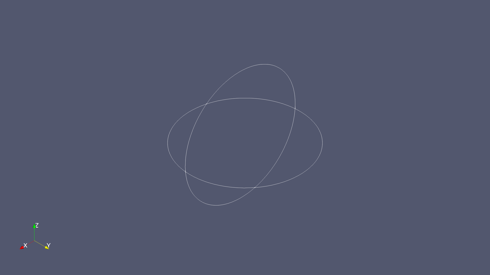

## Curve
Source file: [Curve.py](https://github.com/rweigel/magnetovis/tree/main/magnetovis/Sources/Curve.py) | Demo file: [Curve_demo.py](https://github.com/rweigel/magnetovis/tree/main/magnetovis/Sources/Curve_demo.py)

### Demo 1

```python
import magnetovis as mvs
mvs.Curve()
#mvs.PrintSourceDefaults('Curve')
mvs.SetTitle("Curve with default options")
#mvs.PrintPresentationDefaults('Curve', all=True)
```

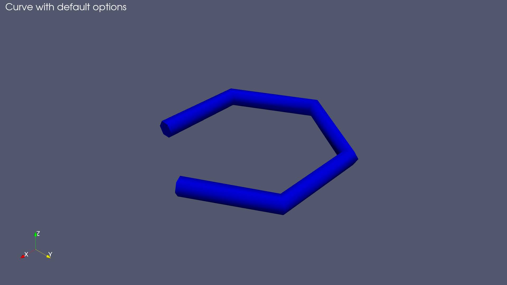

### Demo 2

```python
import magnetovis as mvs
mvs.CreateViewAndLayout()

skwargs = {
            "time": "2001-01-01",
            "coord_sys": "GSM",
            "Resolution": 5,
            "Closed": True,
            "point_function": "circle(radius=1.0, center=(0.0, 0.0, 0.0))"
        }

dkwargs = {
        "display": {
            "Representation": "Surface",
            "Opacity": 1.0,
            "AmbientColor": [1, 1, 0],
            "DiffuseColor": [1, 1, 0],
            "Visibility": 1
        },
        'coloring': {
            'colorBy': None
        }
}

curve = mvs.Curve(**skwargs)
mvs.SetPresentationProperties(source=curve, **dkwargs)
mvs.SetTitle("Curve using alt kwargs for point fn")
```


### Demo 3

```python
import magnetovis as mvs
mvs.CreateViewAndLayout()

skwargs['Closed'] = False
skwargs['Resolution'] = 100
skwargs['point_function'] = "helix(radius=1.0, length=10, rounds=5)"

curve = mvs.Curve(**skwargs)
mvs.SetPresentationProperties(source=curve, **dkwargs)
mvs.SetTitle("Curve using alt point fn")
```


### Demo 4

```python
import magnetovis as mvs
mvs.CreateViewAndLayout()

def _randpts(Npts):

	import numpy as np
	return  -0.5 + np.random.random_sample([Npts,3])

from magnetovis import functions as mvsfunctions
mvsfunctions._randpts = _randpts

skwargs = {
            "time": "2001-01-01",
            "coord_sys": "GSM",
            "Resolution": 100,
            "Closed": False,
            "point_function": "_randpts()"
        }

dkwargs = {
        "display": {
            "Representation": "Surface",
            "Opacity": 1.0,
            "AmbientColor": [1, 1, 0],
            "DiffuseColor": [1, 1, 0],
            "Visibility": 1
        },
        'tube': None,
        'coloring': {
            'colorBy': None
        }
}

curve = mvs.Curve(**skwargs)
mvs.SetPresentationProperties(source=curve, **dkwargs)
mvs.SetTitle("Points from user-defined function; no tube.")
```


### Demo #5

```python
import magnetovis as mvs
mvs.CreateViewAndLayout()

def _parabola(Npts):

  import numpy as np
  xyz = np.zeros([Npts,3])

  xyz[:,1] = 40*np.linspace(-1,1,Npts)
  xyz[:,2] = xyz[:,1]**2/40

  return xyz 

from magnetovis import functions as mvsfunctions
mvsfunctions._parabola = _parabola

skwargs = {
            "time": "2001-01-01",
            "coord_sys": "GSM",
            "Resolution": 100,
            "Closed": False,
            "point_function": "_parabola()"
        }

dkwargs = {
        "display": {
            "Representation": "Surface",
            "Opacity": 1.0,
            "AmbientColor": [1, 1, 0],
            "DiffuseColor": [1, 1, 0],
            "Visibility": 1
        },
        'tube': {
            'source': {
                'Radius': 1.0
            }
        },
        'coloring': {
            'colorBy': ('POINTS', 'xyz', 'Z')
        }
}

mvs.Axis(direction="X")
mvs.Axis(direction="Y")
mvs.Axis(direction="Z")
curve = mvs.Curve(**skwargs)
mvs.SetPresentationProperties(source=curve, **dkwargs)
mvs.SetTitle("Parabola in Y-Z plane colored by Z")

# Color bar that appears by default has a minimum of 4.1e-3
# even though min of xyz >= 0. Not sure why this is. The max
# value is correct, however. The following resets
#import paraview.simple as pvs
import paraview.simple as pvs
curve1 = pvs.GetActiveSource()
renderView1 = pvs.GetActiveViewOrCreate('RenderView')
curve1Display = pvs.GetDisplayProperties(curve1, view=renderView1)
LUT = pvs.GetColorTransferFunction('xyz', curve1Display, separate=True)
LUT.RescaleTransferFunction(0.0, 40.0)
```


## DifferentialDisk
Source file: [DifferentialDisk.py](https://github.com/rweigel/magnetovis/tree/main/magnetovis/Sources/DifferentialDisk.py) | Demo file: [DifferentialDisk_demo.py](https://github.com/rweigel/magnetovis/tree/main/magnetovis/Sources/DifferentialDisk_demo.py)

### Demo 1

```python
import magnetovis as mvs
mvs.DifferentialDisk()
mvs.SetTitle("Differential Disk with Default Options")
```


### Demo 2

```python
import magnetovis as mvs
mvs.CreateViewAndLayout()
mvs.DifferentialDisk(Nr=1)
mvs.SetTitle("Nr=1")
```

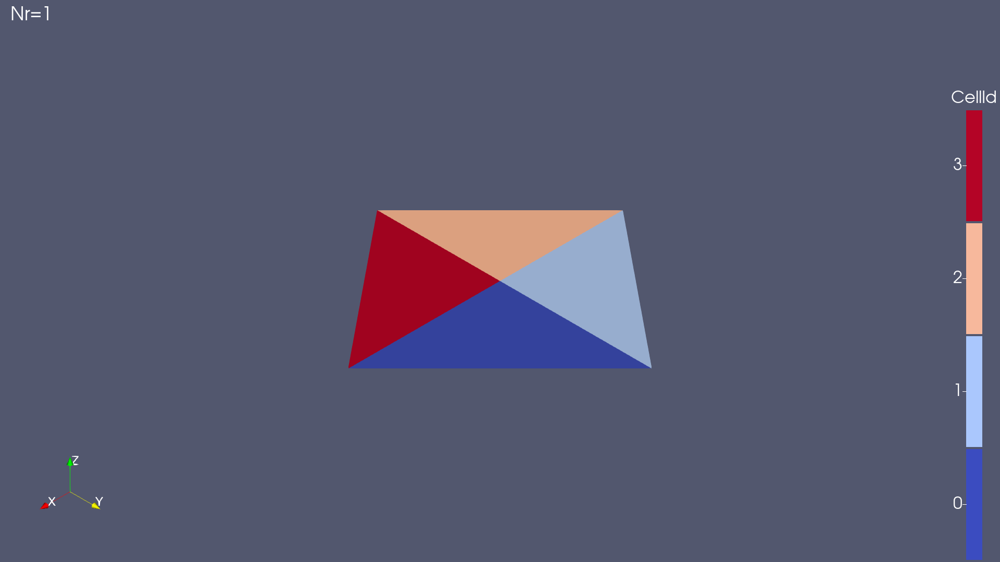

### Demo 3

```python
import magnetovis as mvs
mvs.CreateViewAndLayout()
mvs.DifferentialDisk(ro=1, rf=2, Nφ=10, φo=0, φf=360)
mvs.SetTitle("ro=1, rf=2, Nφ=10, φo=0, φf=360")
```


### Demo 4

```python
import magnetovis as mvs
mvs.CreateViewAndLayout()
mvs.DifferentialDisk(ro=1, rf=2, Nφ=10, φo=0, φf=80, closed=False)
mvs.SetTitle("$ro=1, rf=2, Nφ=10, φo=0, φf=80, closed=False$")
```


## Dipole
Source file: [Dipole.py](https://github.com/rweigel/magnetovis/tree/main/magnetovis/Sources/Dipole.py) | Demo file: [Dipole_demo.py](https://github.com/rweigel/magnetovis/tree/main/magnetovis/Sources/Dipole_demo.py)

### Demo 1

```python
import magnetovis as mvs
mvs.Dipole()
mvs.SetTitle("Dipole with Default Options")
```


### Demo 2

```python
import magnetovis as mvs
mvs.CreateViewAndLayout()
dipole = mvs.Dipole(OutputDataSetType="vtkRectilinearGrid", dimensions=[10, 10, 10])
mvs.SetTitle("Dipole with Stream Trace and Slice")

import paraview.simple as pvs
pvs.Hide(dipole)

streamTracer1 = pvs.StreamTracer(registrationName='StreamTracer1', Input=dipole, SeedType='Line')
streamTracer1.Vectors = ['POINTS', 'B']
streamTracer1.MaximumStreamlineLength = 50.0

#pvs.ColorBy(streamTracer1Display, ('POINTS', 'B', 'Magnitude'))

streamTracer1.SeedType.Point1 = [-20.0, 0.0, 0.0]
streamTracer1.SeedType.Point2 = [-10.0, 0.0, 0.0]
streamTracer1.SeedType.Resolution = 10

pvs.SetActiveSource(streamTracer1)

streamTracer1Display = pvs.Show(streamTracer1)

slice1 = pvs.Slice(registrationName='Slice1', Input=dipole)
slice1.SliceType = 'Plane'
slice1.HyperTreeGridSlicer = 'Plane'
slice1.SliceOffsetValues = [0.0]

slice1.SliceType.Normal = [0.0, 1.0, 0.0]

renderView1 = pvs.GetActiveViewOrCreate('RenderView')
slice1Display = pvs.Show(slice1, renderView1, 'GeometryRepresentation')
pvs.ColorBy(slice1Display, ('CELLS', 'B', 'Magnitude'))

sourceData = pvs.servermanager.Fetch(streamTracer1)
trace0 = sourceData.GetCell(0)
trace0Array = trace0.GetPoints().GetData()
from vtk.util import numpy_support
trace0 = numpy_support.vtk_to_numpy(trace0Array)
print("First 3 x, y, z values for first trace:")
print(trace0[0:3,:])

pvs.Hide3DWidgets(proxy=slice1.SliceType)
```


## Earth
Source file: [Earth.py](https://github.com/rweigel/magnetovis/tree/main/magnetovis/Sources/Earth.py) | Demo file: [Earth_demo.py](https://github.com/rweigel/magnetovis/tree/main/magnetovis/Sources/Earth_demo.py)

### Demo 1

```python
import magnetovis as mvs
mvs.Earth()
mvs.SetTitle("  Earth with Default Options")
```


### Demo 2

```python
import magnetovis as mvs
mvs.CreateViewAndLayout()
mvs.Earth(style="daynight")
mvs.SetTitle('  Earth with style="daynight"')
```


### Demo 3

```python
import magnetovis as mvs
mvs.CreateViewAndLayout()
mvs.Earth()
mvs.SetTitle("  Earth with Axes")

xAxis = mvs.Axis(direction="X", extent=[-3, 3])
mvs.SetPresentationProperties(source=xAxis, 
		**{"label": {"source": {"Text": "$X_{GSM}$"}}})

yAxis = mvs.Axis(direction="Y", extent=[-3, 3])
mvs.SetPresentationProperties(source=yAxis, 
		**{"label": {"source": {"Text": "$Y_{GSM}$"}}})

zAxis = mvs.Axis(direction="Z", extent=[-3, 3])
mvs.SetPresentationProperties(source=zAxis, 
		**{"label": {"source": {"Text": "$Z_{GSM}$"}}})

dkwargs = {
			"display": {
				"AmbientColor": [0.5,0.5,0.5],
				"DiffuseColor": [0.5,0.5,0.5]
			},
			"label": {
				"source": {"Text": "$Z_{GEO}$"},
				"display": {"Color": [0.5,0.5,0.5]}
			}
		}
zAxis2 = mvs.Axis(direction="Z", extent=[-3, 3], coord_sys="GEO")
mvs.SetPresentationProperties(source=zAxis2, **dkwargs)
```

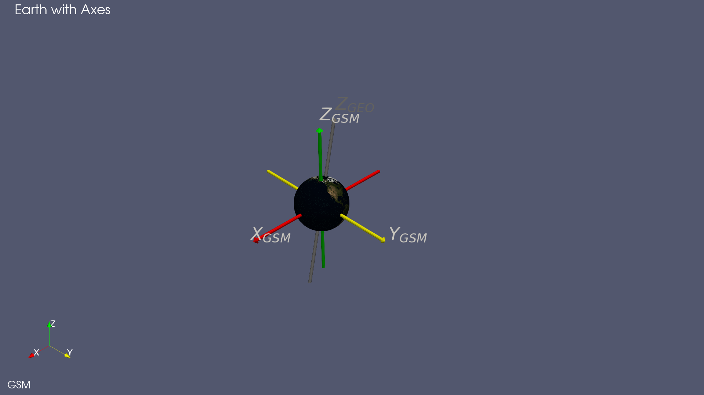

## GridData
Source file: [GridData.py](https://github.com/rweigel/magnetovis/tree/main/magnetovis/Sources/GridData.py) | Demo file: [GridData_demo.py](https://github.com/rweigel/magnetovis/tree/main/magnetovis/Sources/GridData_demo.py)

### Demo 1

```python
import magnetovis as mvs
mvs.GridData(OutputDataSetType="vtkImageData")
mvs.SetTitle("Dataset Type = vtkImageData")
```


### Demo 2

```python
import magnetovis as mvs
mvs.CreateViewAndLayout()
mvs.GridData(OutputDataSetType="vtkRectilinearGrid")
mvs.SetTitle("Dataset Type = vtkRectilinearGrid")
```


### Demo 3

```python
import magnetovis as mvs
mvs.CreateViewAndLayout()
mvs.GridData(OutputDataSetType="vtkStructuredGrid")
mvs.SetTitle("Dataset Type = vtkStructuredGrid")
```


### Demo 4

```python
import magnetovis as mvs
mvs.CreateViewAndLayout()

kwargs = {
        "time": "2001-01-01T00:00:00",
        "coord_sys": "GSM",
        "dimensions": [4,4,4],
        "point_array_functions": [
                                "dipole()",
                                "radius()"
                            ],
        "cell_array_functions": [
                                "r: radius()"
                            ],
        "dimensions": [10, 10, 10]
    }

registrationName = "Dipole on Structured Grid/{}/{}" \
                    .format(mvs.util.trim_iso(kwargs['time']), kwargs['coord_sys'])
kwargs["registrationName"] = registrationName

mvs.Axis(direction="X", extent=[0, 1.5], vtkTubeFilter=['Radius: 0.02'])
mvs.Axis(direction="Y", extent=[0, 1.5], vtkTubeFilter=['Radius: 0.02'])
mvs.Axis(direction="Z", extent=[0, 1.5], vtkTubeFilter=['Radius: 0.02'])

sg2 = mvs.GridData(**kwargs)

dkwargs = {
        "display": {
            "Representation": "Surface With Edges",
            "Opacity": 1.0,
            "AmbientColor": [1, 1, 0],
            "DiffuseColor": [1, 1, 0],
            "Visibility": 1
        },
        'coloring': {
            'colorBy': ('POINTS', 'dipole'),
            'scalarBar': {
                            'Title': r"$\|\mathbf{B}\|$ [nT]",
                            'ComponentTitle': '',
                            'HorizontalTitle': 1,
                            'TitleJustification': 'Left',
                            'Visibility': 1,
                            'DrawNanAnnotation': 1,
                            'ScalarBarLength': 0.8,
                        },
            'colorTransferFunction': {
                                        'UseLogScale': 1,
                                        'AutomaticRescaleRangeMode': 1,
                                        'AutomaticRescaleRangeMode': "Grow and update on 'Apply'",
                                        'NumberOfTableValues': 16
                                    }
        }
}

mvs.SetPresentationProperties(**dkwargs)
mvs.SetCamera(Azimuth=225.0)
mvs.SetTitle(r"$\alpha$/β", title=registrationName)
```


## LatLong
Source file: [LatLong.py](https://github.com/rweigel/magnetovis/tree/main/magnetovis/Sources/LatLong.py) | Demo file: [LatLong_demo.py](https://github.com/rweigel/magnetovis/tree/main/magnetovis/Sources/LatLong_demo.py)

### Demo 1

```python
import magnetovis as mvs
mvs.SetOrientationAxisLabel()
mvs.Earth()
mvs.LatLong(coord_sys="GEO")
mvs.SetTitle()
```

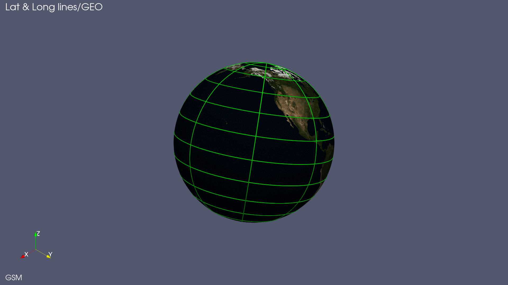

### Demo 2

```python
import magnetovis as mvs
mvs.CreateViewAndLayout()
mvs.SetOrientationAxisLabel(Text="GEO")
mvs.Earth(coord_sys="GEO", coord_sys_view="GEO")
mvs.LatLong(coord_sys="GEO", coord_sys_view="GEO")
mvs.SetTitle()
```

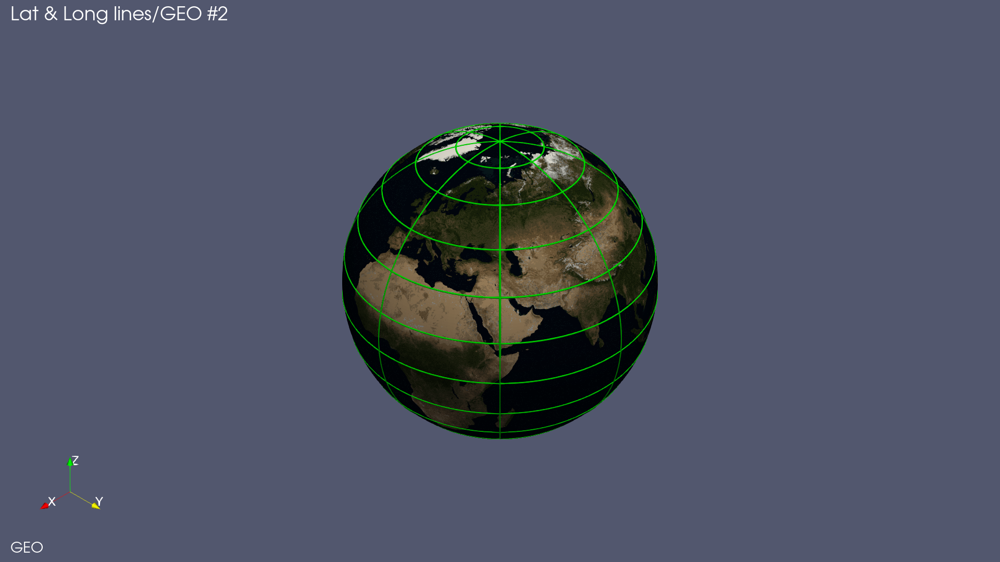

### Demo 3

```python
import magnetovis as mvs
mvs.CreateViewAndLayout()
mvs.SetOrientationAxisLabel()
mvs.Earth()
mvs.LatLong(coord_sys="GEO")
mvs.SetTitle()
mvs.SetOrientationAxisLabel()
zAxis = mvs.Axis(direction="Z", coord_sys="GEO", extent=[-3, 3])
mvs.SetPresentationProperties(source=zAxis, 
    **{"label": {"source": {"Text": "$Z_{GEO}$"}}})
```


### Demo 4

```python
import magnetovis as mvs
mvs.CreateViewAndLayout()
mvs.SetOrientationAxisLabel()
mvs.Earth()
mvs.LatLong(coord_sys="MAG")
mvs.SetTitle()
mvs.SetOrientationAxisLabel()
zAxis = mvs.Axis(direction="Z", coord_sys="MAG", extent=[-3, 3])
mvs.SetPresentationProperties(source=zAxis, 
    **{"label": {"source": {"Text": "$Z_{MAG}$"}}})
```


## Lines
Source file: [Lines.py](https://github.com/rweigel/magnetovis/tree/main/magnetovis/Sources/Lines.py) | Demo file: [Lines_demo.py](https://github.com/rweigel/magnetovis/tree/main/magnetovis/Sources/Lines_demo.py)

### Demo 1

```python
import magnetovis as mvs
mvs.Lines()
#mvs.PrintSourceDefaults('Lines')
mvs.SetTitle("Line with default options")
#mvs.PrintPresentationDefaults('Lines', all=True)
```


### Demo #2

```python
import magnetovis as mvs
mvs.CreateViewAndLayout()

kwargs = {
            "time": "2001-01-01",
            "coord_sys": "GSM",
            "Nlines": 3,
            "closed": True,
            "point_function": "circle(radius=1.0, center=(0.0, 0.0, 0.0))"
        }

mvs.Lines(**kwargs)
```

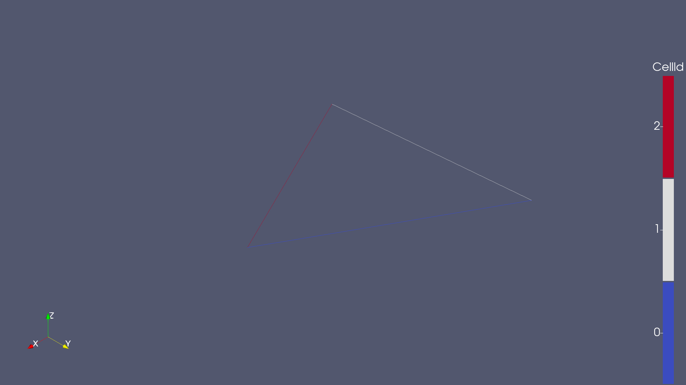

## Plasmasphere
Source file: [Plasmasphere.py](https://github.com/rweigel/magnetovis/tree/main/magnetovis/Sources/Plasmasphere.py) | Demo file: [Plasmasphere_demo.py](https://github.com/rweigel/magnetovis/tree/main/magnetovis/Sources/Plasmasphere_demo.py)

### Demo 1

```python
import magnetovis as mvs
plasmasphere = mvs.Plasmasphere()
mvs.SetTitle()
mvs.SetOrientationAxisLabel('GSM')
```

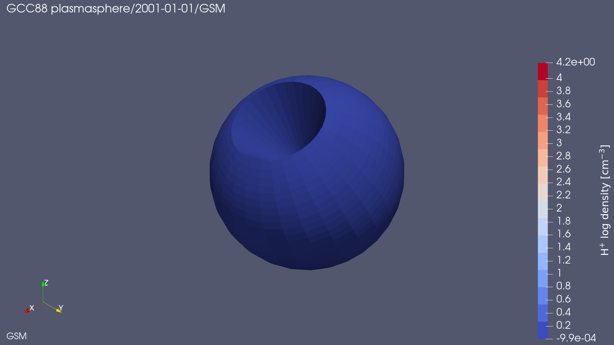

### Demo #2

```python
import magnetovis as mvs
mvs.CreateViewAndLayout()
plasmasphere = mvs.Plasmasphere(coord_sys='SM', coord_sys_view='SM')
mvs.SetTitle()
mvs.Earth(coord_sys='SM', coord_sys_view='SM')
mvs.SetOrientationAxisLabel('SM')

# Add slice
import paraview.simple as pvs
pvs.Hide(plasmasphere)
slice1 = pvs.Slice(registrationName=' y=0 slice', Input=plasmasphere)
slice1.SliceType = 'Plane'
slice1.HyperTreeGridSlicer = 'Plane'
slice1.SliceOffsetValues = [0.0]
slice1.SliceType.Normal = [0.0, 1.0, 0.0]

renderView1 = pvs.GetActiveViewOrCreate('RenderView')
slice1Display = pvs.Show(slice1, renderView1, 'GeometryRepresentation')

# Show slice color bar
slice1Display.SetScalarBarVisibility(renderView1, True)
pvs.Hide3DWidgets(proxy=slice1.SliceType)

# Add countour
contour1 = pvs.Contour(registrationName='1.5 Contour', Input=slice1)
contour1.ContourBy = ['POINTS', 'H+ log density [cm^-3]']
contour1.Isosurfaces = [1.5]
contour1.PointMergeMethod = 'Uniform Binning'
pvs.Show(contour1)

color = [1.0, 0.0, 0.0]
tube = pvs.Tube(contour1)
pvs.Show(tube)
mvs.SetColor(color)

text = pvs.Text(Text='log(n) = 1.5')
pvs.Show(text, TextPropMode='Billboard 3D Text', BillboardPosition=[-5, 0.1, 0.0], Color=color)

mvs.SetCamera(viewType="-Y")
```


### Demo #3

```python
import magnetovis as mvs
import paraview.simple as pvs
mvs.CreateViewAndLayout()
plasmasphere = mvs.Plasmasphere()
pvs.Hide(plasmasphere)
mvs.SetTitle("log$(n)=1.5$", source=plasmasphere)
mvs.Earth()
mvs.SetOrientationAxisLabel('GSM')

# Add slice
import paraview.simple as pvs

# Add countour
contour1 = pvs.Contour(registrationName='1.5 Contour', Input=plasmasphere)
contour1.ContourBy = ['POINTS', 'H+ log density [cm^-3]']
contour1.Isosurfaces = [1.5]
contour1.PointMergeMethod = 'Uniform Binning'
pvs.Hide3DWidgets(proxy=slice1.SliceType)

clip1 = pvs.Clip(registrationName='y=0 slice', Input=contour1)
clip1.ClipType = 'Plane'
clip1.Value = [0.0]
clip1.ClipType.Origin = [0.0, 1.0, 0.0]
clip1.ClipType.Normal = [0.0, 1.0, 0.0]
pvs.Hide3DWidgets(proxy=clip1.ClipType)
pvs.Show(clip1)
mvs.SetCamera(viewType="isometric")
```

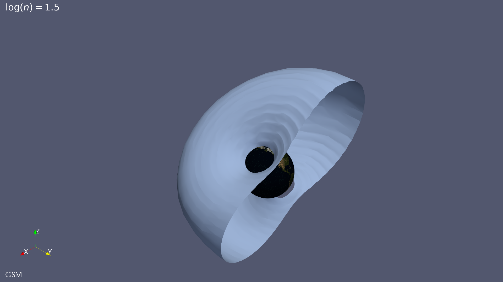

## Satellite
Source file: [Satellite.py](https://github.com/rweigel/magnetovis/tree/main/magnetovis/Sources/Satellite.py) | Demo file: [Satellite_demo.py](https://github.com/rweigel/magnetovis/tree/main/magnetovis/Sources/Satellite_demo.py)

### Demo 1

```python
import magnetovis as mvs
mvs.Satellite()
```


### Demo #2

```python
import magnetovis as mvs
mvs.CreateViewAndLayout()
skwargs = {
	"start": "2010-01-04T00:00:00",
	"stop": "2010-01-05T00:00:00",
	"coord_sys": "GSM"
}
themisa = mvs.Satellite(id='themisa', **skwargs)
themisb = mvs.Satellite(id='themisb', **skwargs)

dkwargs = {
            "label":
                {
                    "source": {"Text": ""},
                    "display": {
                        "FontSize": 24,
                        "Color": [0.5, 0.5, 0.5]
                    }
                }
            }

dkwargs['label']['source']['Text'] = 'THEMIS A'
dkwargs['label']['display']['Color'] = [0, 0, 1]
mvs.SetPresentationProperties(source=themisa, **dkwargs)

dkwargs['label']['source']['Text'] = 'THEMIS B'
dkwargs['label']['display']['Color'] = [1, 0, 0]
mvs.SetPresentationProperties(source=themisb, **dkwargs)

mvs.SetCamera(Azimuth=45, Elevation=45)

mvs.SetTitle(mvs.util.trim_iso(skwargs["start"]) \
			+ " - " + mvs.util.trim_iso(skwargs["stop"]) \
			+ " " + skwargs["coord_sys"], registrationName="Title")
```


## T89c
Source file: [T89c.py](https://github.com/rweigel/magnetovis/tree/main/magnetovis/Sources/T89c.py) | Demo file: [T89c_demo.py](https://github.com/rweigel/magnetovis/tree/main/magnetovis/Sources/T89c_demo.py)

### Demo 1

```python
import magnetovis as mvs
t89c = mvs.T89c(dimensions=[20, 20, 20])
mvs.SetTitle()
```


### Demo 2

```python
import magnetovis as mvs
mvs.CreateViewAndLayout()
t89c = mvs.T89c(dimensions=[20, 20, 20])
mvs.SetTitle()

import paraview.simple as pvs
pvs.Hide(t89c)
streamTracer1 = pvs.StreamTracer(registrationName='StreamTracer1', Input=t89c, SeedType='Line')
streamTracer1.Vectors = ['POINTS', 'B']
streamTracer1.MaximumStreamlineLength = 20.0

# init the 'Line' selected for 'SeedType'
streamTracer1.SeedType.Point1 = [-10.0, 0.0, 0.0]
streamTracer1.SeedType.Point2 = [-2.0, 0.0, 0.0]
streamTracer1.SeedType.Resolution = 10

# set active source
pvs.SetActiveSource(streamTracer1)

# show data in view
streamTracer1Display = pvs.Show(streamTracer1)
```


## T95CurrentSheet
Source file: [T95CurrentSheet.py](https://github.com/rweigel/magnetovis/tree/main/magnetovis/Sources/T95CurrentSheet.py) | Demo file: [T95CurrentSheet_demo.py](https://github.com/rweigel/magnetovis/tree/main/magnetovis/Sources/T95CurrentSheet_demo.py)

### Demo 1

```python
import magnetovis as mvs
s = mvs.T95CurrentSheet()
```


## CurveProbe
Source file: [CurveProbe.py](https://github.com/rweigel/magnetovis/tree/main/magnetovis/Sources/CurveProbe.py) | Demo file: [CurveProbe_demo.py](https://github.com/rweigel/magnetovis/tree/main/magnetovis/Sources/CurveProbe_demo.py)

### Demo 1

```python
import paraview.simple as pvs
import magnetovis as mvs
mvs.ClearPipeline()
grid = mvs.GridData()
mvs.SetRepresentation('Wireframe')
mvs.SetColor('blue')

line = pvs.Line(Point1=[0.9, 0.0, 0.0], Point2=[0.0, 0.9, 0.9], Resolution=3)

curve = mvs.CurveProbe(Input=[grid, line])
tube = pvs.Tube(Input=curve, Radius=0.01)
mvs.SetColoring(["POINTS", "xyz", "X"])
mvs.SetCamera(viewType='isometric')
```


## RotateUsingVectors
Source file: [RotateUsingVectors.py](https://github.com/rweigel/magnetovis/tree/main/magnetovis/Sources/RotateUsingVectors.py) | Demo file: [RotateUsingVectors_demo.py](https://github.com/rweigel/magnetovis/tree/main/magnetovis/Sources/RotateUsingVectors_demo.py)

### Demo 1

```python
import paraview.simple as pvs
import magnetovis as mvs
a = mvs.Axis()
# Vector1 rotated into Vector2 corresponds to a rotation of 45° around Z
cR = mvs.RotateUsingVectors(Input=a, Vector1=[1, 1, 0], Vector2=[0, 1, 0]) 
mvs.SetTitle()
pvs.Show(cR)
mvs.SetCamera(viewType="-Z")
```


## Rotate
Source file: [Rotate.py](https://github.com/rweigel/magnetovis/tree/main/magnetovis/Sources/Rotate.py) | Demo file: [Rotate_demo.py](https://github.com/rweigel/magnetovis/tree/main/magnetovis/Sources/Rotate_demo.py)

### Demo 1

```python
import paraview.simple as pvs
import magnetovis as mvs
a = mvs.Axis()
# Default is to rotate around Z
cR = mvs.Rotate(Input=a, angle=90) 
pvs.Show(cR)
pvs.ResetCamera()
```


### Demo 2

```python
import paraview.simple as pvs
import magnetovis as mvs
mvs.CreateViewAndLayout()
a = mvs.Axis()
aR = mvs.Rotate(Input=a, angle=90, axis="Y")
pvs.Show(aR)
pvs.ResetCamera()
```


### Demo 3

```python
import paraview.simple as pvs
import magnetovis as mvs
mvs.CreateViewAndLayout()
a = mvs.Axis()
aR = mvs.Rotate(Input=a, angle=89.999999, axis=[1, 1, 0])
pvs.Show(aR)
pvs.ResetCamera()
```


## Transform
Source file: [Transform.py](https://github.com/rweigel/magnetovis/tree/main/magnetovis/Sources/Transform.py) | Demo file: [Transform_demo.py](https://github.com/rweigel/magnetovis/tree/main/magnetovis/Sources/Transform_demo.py)

### Demo 1

```python
import paraview.simple as pvs
import magnetovis as mvs
earth = mvs.Earth(style="daynight")
pvs.Hide(earth)
earthT = mvs.Transform(x=[0, -1, 0], y=[1, 0, 0], Input=earth)
pvs.Show(earthT)
pvs.ResetCamera()
```


