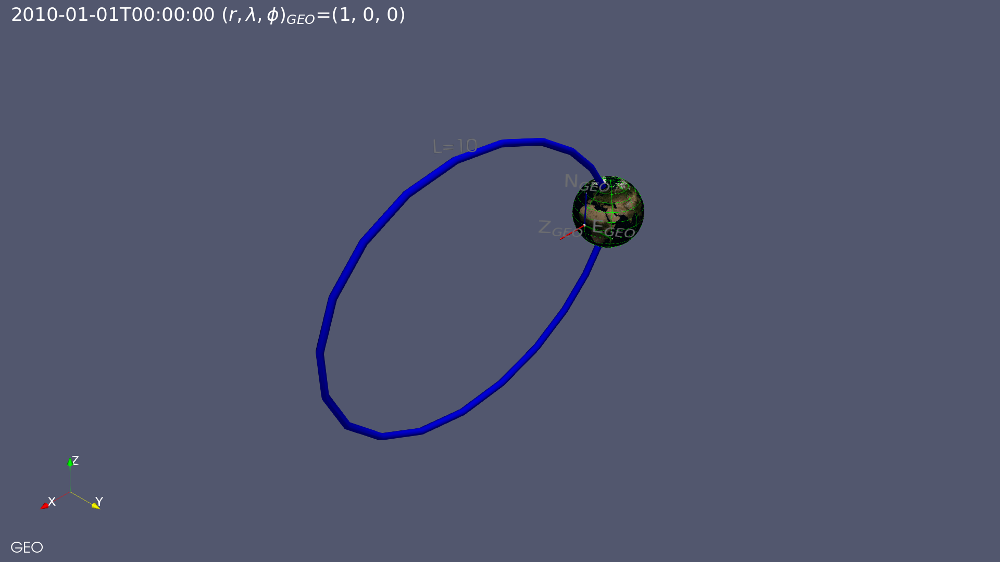

# About

`magnetovis` is a set of Python scripts that display magnetosphere-related objects, regions, and data in [ParaView](https://www.paraview.org/) that was initially developed under NASA Grant Number 80NSSC21K0305.

The objects created by `magnetovis` scripts are displayed in the `ParaView` GUI where the can be inspected, manipulated, and modified.

See the demo files in https://github.com/rweigel/magnetovis for example usage.

# Install

An existing installation of [ParaView 5.9+](https://www.paraview.org/download/) is required. 

ParaView includes a Python 3 version. Because `magnetovis` requires packages that are not distributed with ParaView, you should execute `magnetovis` in a enviroment with the same Python version number as that used by ParaView.

Installation has been only tested in OS-X and Linux. 

Please provide feedback by submitting an [issue](https://github.com/rweigel/magnetovis/issues).

```
git clone https://github.com/rweigel/magnetovis
cd magnetovis
pip install --editable .
magnetovis --script=magnetovis_demo.py
```

# Getting started

`magnetovis` has three distinct parts

1. A collection of Programmable Sources, Filters and Plugins that create and filter Heliophyiscs-related objects. See the [demos](#demos) for a full list and example usage. Most Magnetovis programmable sources (and their associated Plugins) have a set of default display options that are applied automatically when they are created. In Paraview, when a source is added to the pipeline, no display options are set and the user must select the options in the GUI or write a script that sets the options. `magnetovis` objects have default display options that are applied when the object is added to the pipeline.
2. A collection of helper functions for reducing the amount of code needed to modify view properties, the camera, and color bars. See the files starting with "Set" in [the ParaView directory](#).
3. A collection of helper functions for reducing the amount of code needed for creating programmable sources and filters. The functions are in the `vtk` folder.

# Approach

The objects (e.g, Earth, Plasmapause, etc.) in `magnetovis` are created using `ParaView` [`Programmable Sources`](https://docs.paraview.org/en/latest/ReferenceManual/pythonProgrammableFilter.html). Programmable Sources are short Python scripts that create [`VTK`](https://vtk.org) objects.

When a a `magnetovis` Programmable Source is created in a Macro or one the Python command line in Paraview, the user can see and modify the script that created the object. Each Programmable Source in the [Sources](https://github.com/rweigel/magnetovis/tree/main/magnetovis/Sources) directory has a corresponding `Plugin` that is automatically created from the Programmable Source file at startup.

The objects were developed using the ParaView GUI and the [Programmable Source editor](https://docs.paraview.org/en/latest/ReferenceManual/pythonProgrammableFilter.html#recipes-for-programmable-source). The final scripts are then placed in a file in the [Sources](https://github.com/rweigel/magnetovis/tree/main/magnetovis/Sources) directory. Each file in this directory is associated with a object and the code that is used to genereate the object is in a function called `Script()`.

%To demonstrate the general procedure by which magnetovis object are created, we will use the [Helix](https://docs.paraview.org/en/latest/ReferenceManual/pythonProgrammableFilter.html#helix-source) example from the ParaView user's guide.

%Magnetovis objects are listed in the ParaView `Sources` drop-down menu. 

%Selection of these sources creates an unstyled object that can be modified using the `Display (GeometryRepresentation)` menu in the `Properties` window.

%In `magnetovis`, each Programmable Source object has an associated script that adds attributes to the display object such as colors and annotations. To apply these attributes, execute a `Macro` associated with the Programmable Source.

# Development Notes

## Terminology

**ParaView**

* Proxy
* Plugin
* Source (Sometime used for filter, e.g, GetActiveSource() can return a filter)
* Filter
* Display/Representation
* View - types include _Render View_, ...
* Pipeline
* Transfer function/lookup table
* Camera

**Magnetovis**

* Presentation


## Testing and Developing Scripts

ParaView has a script and macro editor. However, the editor is basic and limited. To test scripts created using a different editor, enter the following on the Python Shell command line.

```python
import magnetovis; magnetovis.ClearPipeline() # Optional
exec(open("/absolute/path/to/script.py").read())
```

## Testing and Developing Programmable Sources

On start-up, `magnetovis` creates Programmable Sources based on the files in `magnetovis/Sources`. To create and test your own `magnetovis` programmable source, start with the following template

`/tmp/MySource.py`

```python
def MySource(**kwargs):
  import magnetovis
  return magnetovis.CreateProgrammableSource('/tmp/MySource.py')

def OutputDataSetType():

  # What is set in the drop-down menu for Output Data Set Type for
  # Programmable Source.
  return "vtkPolyData"

def Script(point1=0.0, point2=1.0, resolution=10):

  # What entered into the Script text area for a Programmable Source

  vtkLineSource = vtk.vtkLineSource()
  vtkLineSource.SetPoint1(point1)
  vtkLineSource.SetPoint2(point2)
  vtkLineSource.SetResolution(resolution)
  vtkLineSource.Update()

  output.ShallowCopy(vtkLineSource.GetOutputDataObject(0))

```

To use the source, enter the following in a script or on the Python Shell command line

```python
exec(open("/tmp/MySource.py").read())
source = MySource()
```

After entering the above command, you should see `MySource` in the ParaView pipeline and the content of `Script` will be the in the script text area under the `Properties` tab. Modifications to your source can be tested by either executing the above two commands in the ParaView Python Shell or by modifying the content of `Script` in the ParaView GUI.

# Notes

See `docs/Satellite_Region_Notes.md` for documentation on how magnetosphere regions were computed and a comparison with regions reported by SSCWeb.

# Demos

The demos can be run using

```
git clone https://github.com/rweigel/magnetovis
magnetovis magnetovis/Sources/FILENAME
```

where `FILENAME` is the name of a demo file listed below, e.g., `Axis_demo.py`.

<!-- Demos Start -->
## NEZ

Source file: [NEZ.py](https://github.com/rweigel/magnetovis/tree/main/magnetovis/Demos/NEZ.py) | Demo file: [NEZ_demo.py](https://github.com/rweigel/magnetovis/tree/main/magnetovis/Demos/NEZ_demo.py)

### Demo 1

```python
import paraview.simple as pvs
import magnetovis as mvs
import numpy as np

def nez(time, pos, csys):
  """Unit vectors in geographic north, east, and zenith dirs

    Given a cartesian position `pos` in `csys` at time `time`,
    returns the cartesian unit vectors for geographic north,
    east, and zenith in `csys`.

    Example:
      n_geo, e_geo, z_geo = nez("2010-01-01T00:00:00", (1, 0, 0), "GEO")
      print("North: {}".format(n_geo)) # North: [0. 0. 1.]
      print("East:  {}".format(e_geo)) # East:  [0. 1. 0.]
      print("Z:     {}".format(z_geo)) # Z:     [1. 0. 0.]
  """

  from hxform import hxform as hx

  # Geographic z axis in csys
  Z = hx.transform(np.array([0, 0, 1]), time, 'GEO', csys, lib='cxform')

  # zenith direction ("up")
  z_geo = pos/np.linalg.norm(pos)

  e_geo = np.cross(Z, z_geo)
  e_geo = e_geo/np.linalg.norm(e_geo)

  n_geo = np.cross(z_geo, e_geo)
  n_geo = n_geo/np.linalg.norm(n_geo)

  if False:
    print(f"Unit vectors for Geographic N, E, and Z at {pos} in {csys} at {time}:")
    print("North: {}".format(n_geo))
    print("East:  {}".format(e_geo))
    print("Z:     {}".format(z_geo))

  return n_geo, e_geo, z_geo

def showaxis(pos, n_geo, e_geo, z_geo, pos_label=""):

  def showlabel(dir,base,top):

    Label = pvs.Text(registrationName=dir+'_GEO Label', Text=dir+"$_{GEO}$")
    text1Display = pvs.Show(Label, pvs.GetActiveViewOrCreate('RenderView'), 'TextSourceRepresentation',
      TextPropMode='Flagpole Actor',BasePosition=base,TopPosition=top)

  north = pvs.Line(registrationName="  N_GEO Axis Line", Point1=pos, Point2=pos+n_geo)
  north_tube = pvs.Tube(north, registrationName="  N_GEO Axis Tube", Radius=0.02)
  mvs.SetColor('blue')
  pvs.Show(north_tube)
  showlabel('N', pos+n_geo, pos+1.05*n_geo)

  east = pvs.Line(registrationName="  E_GEO Axis Line", Point1=pos, Point2=pos+e_geo)
  east_tube = pvs.Tube(east, registrationName="  E_GEO Axis Tube", Radius=0.02)
  mvs.SetColor('green')
  pvs.Show(east_tube)
  showlabel('E', pos+e_geo, pos+e_geo+0.05*n_geo)

  up = pvs.Line(registrationName="  Z_GEO Axis Line", Point1=pos, Point2=pos+z_geo)
  up_tube = pvs.Tube(up, registrationName="  Z_GEO Axis Tube", Radius=0.02)
  mvs.SetColor('red')
  pvs.Show(up_tube)
  showlabel('Z', pos+z_geo, pos+z_geo+0.05*n_geo)

  s = pvs.Sphere(registrationName=pos_label, Radius=0.05, Center=pos)
  pvs.Show(s)
```



### Demo 1

```python
time = "2010-01-01T00:00:00"
pos_GEO = (1, 0, 0)
csys = "GEO"
pos_GEO_label = f"$(r,\\lambda,\\phi)_{{GEO}}$={pos_GEO}"
from hxform import hxform as hx
pos = hx.transform(np.array(pos_GEO), time, 'GEO', csys, ctype_in="sph", ctype_out="car", lib='cxform')
n_geo, e_geo, z_geo = nez(time, pos_GEO, csys)

showaxis(pos_GEO, n_geo, e_geo, z_geo, pos_label=pos_GEO_label)
mvs.SetOrientationAxisLabel(Text="GEO")
mvs.Earth(time=time, coord_sys=csys)
mvs.SetTitle(f"{time} {pos_GEO_label}")
mvs.LatLong(coord_sys=csys, coord_sys_view=csys)
```


