## Arc (Source)

Source file: [Arc.py](https://github.com/rweigel/magnetovis/tree/main/magnetovis/Sources/Arc.py) | Demo file: [Arc_demo.py](https://github.com/rweigel/magnetovis/tree/main/magnetovis/Sources/Arc_demo.py)

### Demo 1

```python
# Demo 1
import paraview.simple as pvs
import magnetovis as mvs
arc = mvs.Arc()
tube = pvs.Tube(arc)
pvs.Show(tube)


```

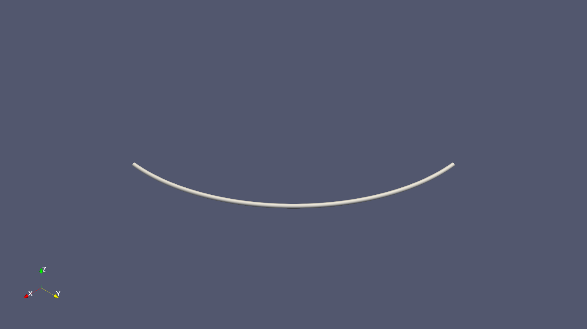

### Demo 2

```python
# Demo 2
import paraview.simple as pvs
import magnetovis as mvs
mvs.CreateViewAndLayout()
mvs.Earth(coord_sys="GEO", coord_sys_view="GEO")
arc = mvs.Arc(Radisus=1.01, Direction=[0, 1, 0], StartPhi=-90, EndPhi=90)

color = [1.0, 0.0, 0.0]
tube = pvs.Tube(arc)
pvs.Show(tube, DiffuseColor=color)

text = pvs.Text(Text='Prime Meridian')
pvs.Show(text, TextPropMode='Billboard 3D Text', BillboardPosition=[0, 0, 1.05], Color=[1.0, 0.0, 0.0])


```


## Axis (Source)

Source file: [Axis.py](https://github.com/rweigel/magnetovis/tree/main/magnetovis/Sources/Axis.py) | Demo file: [Axis_demo.py](https://github.com/rweigel/magnetovis/tree/main/magnetovis/Sources/Axis_demo.py)

### Demo 1

```python
# Demo 1
import magnetovis as mvs
mvs.Axis()
#mvs.PrintSourceDefaults('Axis')
mvs.SetTitle("Axis with default options")
#mvs.PrintPresentationDefaults('Axis', all=True)


```


### Demo 2

```python
# Demo 2
import magnetovis as mvs
mvs.CreateViewAndLayout()

skwargs = {
            "time": "2001-01-01",
            "coord_sys": "GSM",
            "tube": True,
            "tubeAndCone": True,
            "tubeFilterSettings": ["Radius: 0.5", "Capping: 1"]
        }

dkwargs = {
            "display": {
                "Representation": "Surface",
                "Opacity": 1.0,
                "AmbientColor": [1, 1, 0],
                "DiffuseColor": [1, 1, 0],
                "Visibility": 1
            },

            "label":
                {
                    "source": {"Text": r"$\alpha^2$/β"},
                    "display": {
                        "FontSize": 24,
                        "Color": [1, 1, 0]
                    }
                }
        }


skwargs['direction'] = "X"
skwargs['extent'] = [-40, 40]
xAxis = mvs.Axis()

skwargs['direction'] = "Y"
skwargs['extent'] = [-40, 40]
yAxis = mvs.Axis(registrationName="s^2/β Axis", **skwargs)
mvs.SetPresentationProperties(source=yAxis, **dkwargs)
mvs.SetTitle("Three Axes")

skwargs['direction'] = "Z"
skwargs['extent'] = [-40, 40]
zAxis = mvs.Axis(**skwargs)

```


## Bowshock (Source)

Source file: [Bowshock.py](https://github.com/rweigel/magnetovis/tree/main/magnetovis/Sources/Bowshock.py) | Demo file: [Bowshock_demo.py](https://github.com/rweigel/magnetovis/tree/main/magnetovis/Sources/Bowshock_demo.py)

### Demo 1

```python
# Execute using
#   magnetovis Bowshock_demo.py

# Demo 1
import magnetovis as mvs
bowshock = mvs.Bowshock()

```


## Circle (Source)

Source file: [Circle.py](https://github.com/rweigel/magnetovis/tree/main/magnetovis/Sources/Circle.py) | Demo file: [Circle_demo.py](https://github.com/rweigel/magnetovis/tree/main/magnetovis/Sources/Circle_demo.py)

### Demo 1

```python
# Demo 1
import magnetovis as mvs
mvs.Circle()


```


## Curve (Source)

Source file: [Curve.py](https://github.com/rweigel/magnetovis/tree/main/magnetovis/Sources/Curve.py) | Demo file: [Curve_demo.py](https://github.com/rweigel/magnetovis/tree/main/magnetovis/Sources/Curve_demo.py)

### Demo 1

```python
# Demo 1
import magnetovis as mvs
mvs.Curve()
mvs.SetCamera(viewType="isometric", Zoom=10)

#mvs.PrintSourceDefaults('Curve')
mvs.SetTitle("Curve with default options")
#mvs.PrintPresentationDefaults('Curve', all=True)


```


### Demo 2

```python
# Demo 2
import magnetovis as mvs
mvs.CreateViewAndLayout()

skwargs = {
            "time": "2001-01-01",
            "coord_sys": "GSM",
            "Resolution": 5,
            "Closed": True,
            "point_function": "circle(radius=1.0, center=(0.0, 0.0, 0.0))"
        }

dkwargs = {
        "display": {
            "Representation": "Surface",
            "Opacity": 1.0,
            "AmbientColor": [1, 1, 0],
            "DiffuseColor": [1, 1, 0],
            "Visibility": 1
        },
        'coloring': {
            'colorBy': None
        }
}

curve = mvs.Curve(**skwargs)
mvs.SetPresentationProperties(source=curve, **dkwargs)
mvs.SetTitle("Curve using alt kwargs for point fn")


```

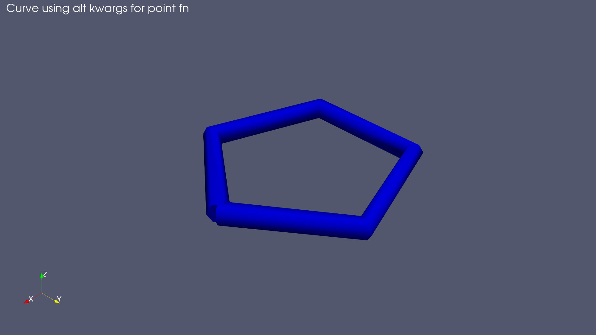

### Demo 3

```python
# Demo 3
import magnetovis as mvs
mvs.CreateViewAndLayout()

skwargs['Closed'] = False
skwargs['Resolution'] = 100
skwargs['point_function'] = "helix(radius=1.0, length=10, rounds=5)"

curve = mvs.Curve(**skwargs)
mvs.SetPresentationProperties(source=curve, **dkwargs)
mvs.SetTitle("Curve using alt point fn")


```


### Demo 4

```python
# Demo 4
import magnetovis as mvs
mvs.CreateViewAndLayout()

def _randpts(Npts):

	import numpy as np
	return  -0.5 + np.random.random_sample([Npts,3])

from magnetovis import functions as mvsfunctions
mvsfunctions._randpts = _randpts

skwargs = {
            "time": "2001-01-01",
            "coord_sys": "GSM",
            "Resolution": 100,
            "Closed": False,
            "point_function": "_randpts()"
        }

dkwargs = {
        "display": {
            "Representation": "Surface",
            "Opacity": 1.0,
            "AmbientColor": [1, 1, 0],
            "DiffuseColor": [1, 1, 0],
            "Visibility": 1
        },
        'tube': None,
        'coloring': {
            'colorBy': None
        }
}

curve = mvs.Curve(**skwargs)
mvs.SetPresentationProperties(source=curve, **dkwargs)
mvs.SetTitle("Points from user-defined function; no tube.")


```


### Demo 5

```python
# Demo #5
import magnetovis as mvs
mvs.CreateViewAndLayout()

def _parabola(Npts):

  import numpy as np
  xyz = np.zeros([Npts,3])

  xyz[:,1] = 40*np.linspace(-1,1,Npts)
  xyz[:,2] = xyz[:,1]**2/40

  return xyz 

from magnetovis import functions as mvsfunctions
mvsfunctions._parabola = _parabola

skwargs = {
            "time": "2001-01-01",
            "coord_sys": "GSM",
            "Resolution": 100,
            "Closed": False,
            "point_function": "_parabola()"
        }

dkwargs = {
        "display": {
            "Representation": "Surface",
            "Opacity": 1.0,
            "AmbientColor": [1, 1, 0],
            "DiffuseColor": [1, 1, 0],
            "Visibility": 1
        },
        'tube': {
            'source': {
                'Radius': 1.0
            }
        },
        'coloring': {
            'colorBy': ('POINTS', 'xyz', 'Z')
        }
}

mvs.Axis(direction="X")
mvs.Axis(direction="Y")
mvs.Axis(direction="Z")
curve = mvs.Curve(**skwargs)
mvs.SetPresentationProperties(source=curve, **dkwargs)
mvs.SetTitle("Parabola in Y-Z plane colored by Z")

# Color bar that appears by default has a minimum of 4.1e-3
# even though min of xyz >= 0. Not sure why this is*. The max
# value is correct, however. The following resets
# * Coloring by amplitude of tube?
import paraview.simple as pvs
curve1 = pvs.GetActiveSource()
renderView1 = pvs.GetActiveViewOrCreate('RenderView')
curve1Display = pvs.GetDisplayProperties(curve1, view=renderView1)
LUT = pvs.GetColorTransferFunction('xyz', curve1Display, separate=True)
LUT.RescaleTransferFunction(0.0, 40.0)

```


## DifferentialDisk (Source)

Source file: [DifferentialDisk.py](https://github.com/rweigel/magnetovis/tree/main/magnetovis/Sources/DifferentialDisk.py) | Demo file: [DifferentialDisk_demo.py](https://github.com/rweigel/magnetovis/tree/main/magnetovis/Sources/DifferentialDisk_demo.py)

### Demo 1

```python
# Demo 1
import magnetovis as mvs
mvs.DifferentialDisk()
mvs.SetColoring(colorTransferFunction={"separate": True})
mvs.SetTitle("Differential Disk with Default Options")


```

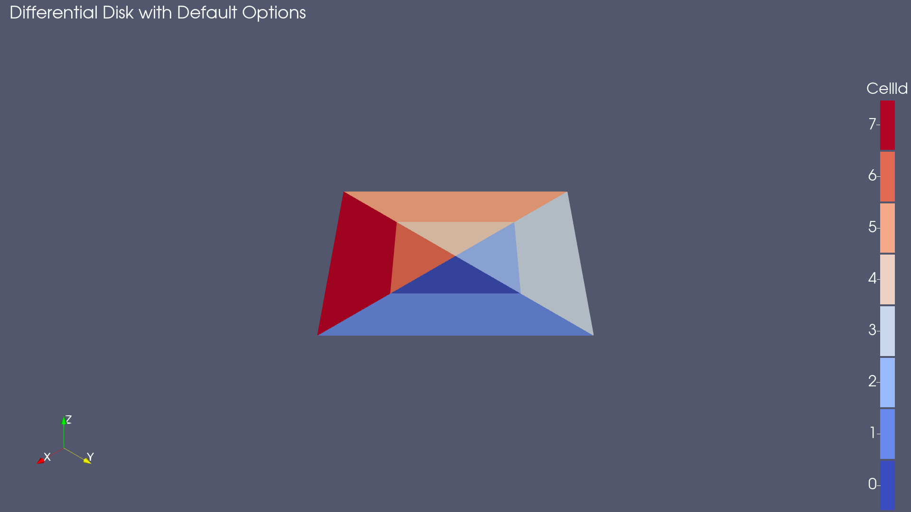

### Demo 2

```python
# Demo 2
import magnetovis as mvs
mvs.CreateViewAndLayout()
mvs.DifferentialDisk(Nr=1)
mvs.SetColoring(colorTransferFunction={"separate": True})
mvs.SetTitle("Nr=1")


```


### Demo 3

```python
# Demo 3
import magnetovis as mvs
mvs.CreateViewAndLayout()
mvs.DifferentialDisk(ro=1, rf=2, Nφ=10, φo=0, φf=360)
mvs.SetColoring(colorTransferFunction={"separate": True})
mvs.SetTitle("ro=1, rf=2, Nφ=10, φo=0, φf=360")


```

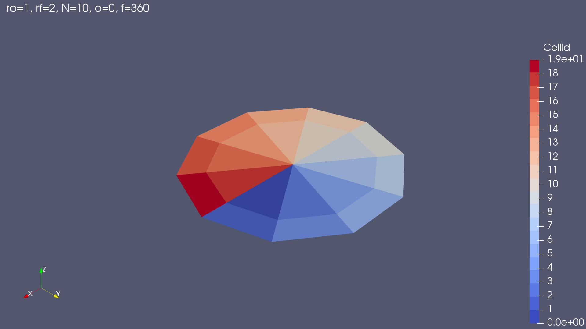

### Demo 4

```python
# Demo 4
import magnetovis as mvs
mvs.CreateViewAndLayout()
mvs.DifferentialDisk(ro=1, rf=2, Nφ=10, φo=0, φf=80, closed=False)
mvs.SetColoring(colorTransferFunction={"separate": True})
mvs.SetTitle("$ro=1, rf=2, Nφ=10, φo=0, φf=80, closed=False$")

```

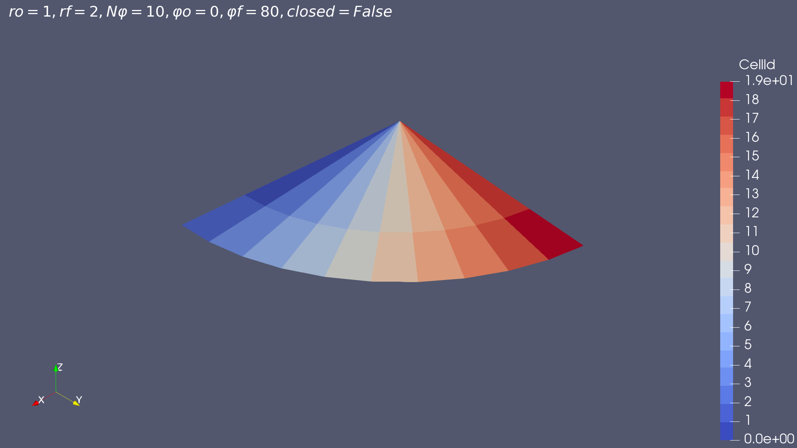

## Dipole (Source)

Source file: [Dipole.py](https://github.com/rweigel/magnetovis/tree/main/magnetovis/Sources/Dipole.py) | Demo file: [Dipole_demo.py](https://github.com/rweigel/magnetovis/tree/main/magnetovis/Sources/Dipole_demo.py)

### Demo 1

```python
# Demo 1
import magnetovis as mvs
mvs.Dipole()
mvs.SetTitle("Dipole with Default Options")


```


### Demo 2

```python
# Demo 2
import magnetovis as mvs
mvs.CreateViewAndLayout()
dipole = mvs.Dipole(OutputDataSetType="vtkRectilinearGrid", dimensions=[10, 10, 10])
mvs.SetTitle("Dipole with Stream Trace and Slice")

import paraview.simple as pvs
pvs.Hide(dipole)

streamTracer1 = pvs.StreamTracer(registrationName='StreamTracer1', Input=dipole, SeedType='Line')
streamTracer1.Vectors = ['POINTS', 'B']
streamTracer1.MaximumStreamlineLength = 50.0

#pvs.ColorBy(streamTracer1Display, ('POINTS', 'B', 'Magnitude'))

streamTracer1.SeedType.Point1 = [-20.0, 0.0, 0.0]
streamTracer1.SeedType.Point2 = [-10.0, 0.0, 0.0]
streamTracer1.SeedType.Resolution = 10

pvs.SetActiveSource(streamTracer1)

streamTracer1Display = pvs.Show(streamTracer1)

slice1 = pvs.Slice(registrationName='Slice1', Input=dipole)
slice1.SliceType = 'Plane'
slice1.HyperTreeGridSlicer = 'Plane'
slice1.SliceOffsetValues = [0.0]

slice1.SliceType.Normal = [0.0, 1.0, 0.0]

renderView1 = pvs.GetActiveViewOrCreate('RenderView')
slice1Display = pvs.Show(slice1, renderView1, 'GeometryRepresentation')
pvs.ColorBy(slice1Display, ('CELLS', 'B', 'Magnitude'))

sourceData = pvs.servermanager.Fetch(streamTracer1)
trace0 = sourceData.GetCell(0)
trace0Array = trace0.GetPoints().GetData()
from vtk.util import numpy_support
trace0 = numpy_support.vtk_to_numpy(trace0Array)
print("First 3 x, y, z values for first trace:")
print(trace0[0:3,:])

pvs.Hide3DWidgets(proxy=slice1.SliceType)

```


## Earth (Source)

Source file: [Earth.py](https://github.com/rweigel/magnetovis/tree/main/magnetovis/Sources/Earth.py) | Demo file: [Earth_demo.py](https://github.com/rweigel/magnetovis/tree/main/magnetovis/Sources/Earth_demo.py)

### Demo 1

```python
# Demo 1
import magnetovis as mvs
mvs.Earth()
mvs.SetTitle("  Earth with Default Options")
mvs.SetOrientationAxisLabel('GSM')


```

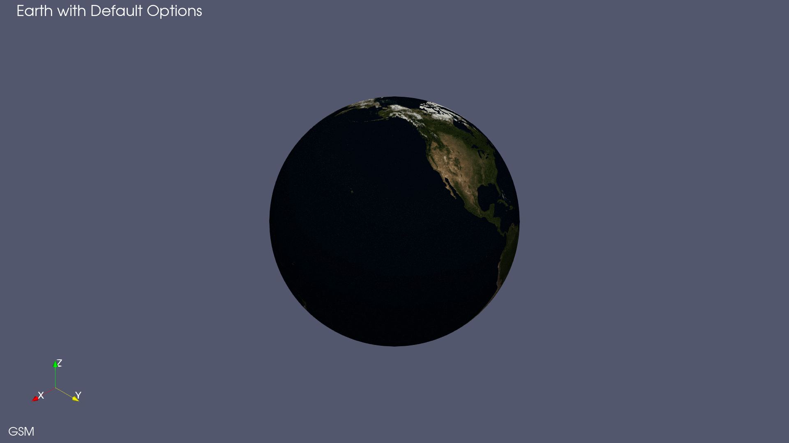

### Demo 2

```python
# Demo 2
import magnetovis as mvs
mvs.CreateViewAndLayout()
mvs.Earth(style="daynight")
mvs.SetTitle('  Earth with style="daynight"')
mvs.SetOrientationAxisLabel('GSM')


```

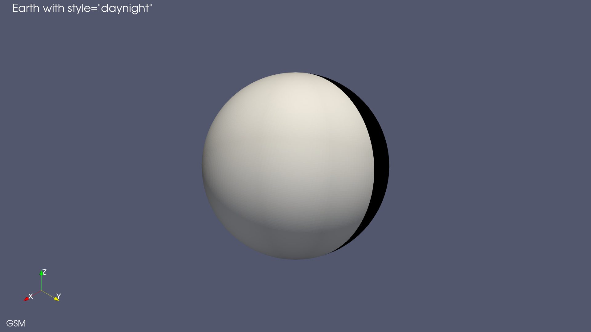

### Demo 3

```python
# Demo 3
import magnetovis as mvs
mvs.CreateViewAndLayout()
mvs.Earth()
mvs.SetTitle("  Earth with Axes")
mvs.SetOrientationAxisLabel('GSM')

xAxis = mvs.Axis(direction="X", extent=[-3, 3])
mvs.SetPresentationProperties(source=xAxis, 
		**{"label": {"source": {"Text": "$X_{GSM}$"}}})

yAxis = mvs.Axis(direction="Y", extent=[-3, 3])
mvs.SetPresentationProperties(source=yAxis, 
		**{"label": {"source": {"Text": "$Y_{GSM}$"}}})

zAxis = mvs.Axis(direction="Z", extent=[-3, 3])
mvs.SetPresentationProperties(source=zAxis, 
		**{"label": {"source": {"Text": "$Z_{GSM}$"}}})

dkwargs = {
			"display": {
				"AmbientColor": [0.5,0.5,0.5],
				"DiffuseColor": [0.5,0.5,0.5]
			},
			"label": {
				"source": {"Text": "$Z_{GEO}$"},
				"display": {"Color": [0.5,0.5,0.5]}
			}
		}
zAxis2 = mvs.Axis(direction="Z", extent=[-3, 3], coord_sys="GEO")
mvs.SetPresentationProperties(source=zAxis2, **dkwargs)


```


## GridData (Source)

Source file: [GridData.py](https://github.com/rweigel/magnetovis/tree/main/magnetovis/Sources/GridData.py) | Demo file: [GridData_demo.py](https://github.com/rweigel/magnetovis/tree/main/magnetovis/Sources/GridData_demo.py)

### Demo 1

```python
# Demo 1
import magnetovis as mvs
mvs.GridData(OutputDataSetType="vtkImageData")
mvs.SetTitle("Dataset Type = vtkImageData")


```

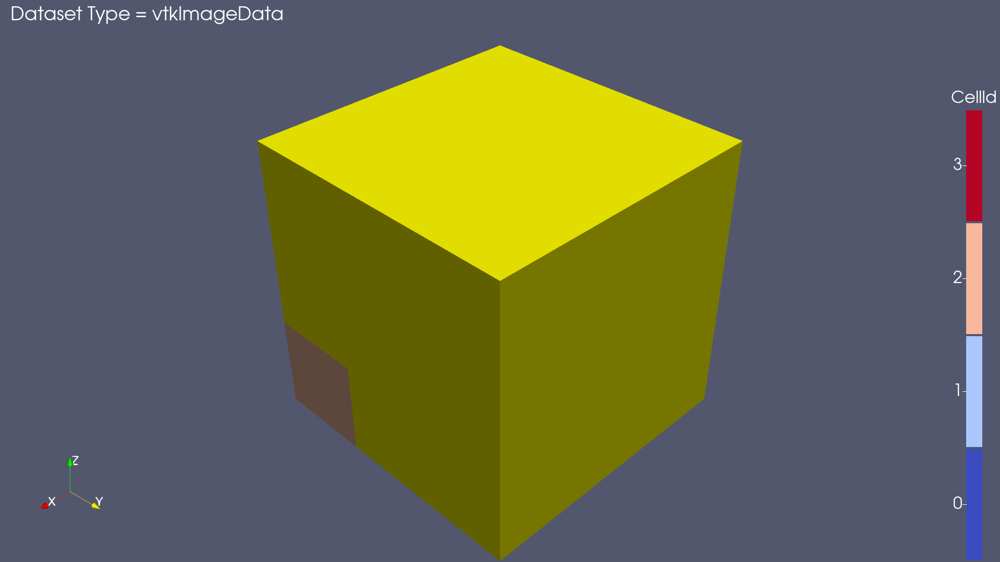

### Demo 2

```python
# Demo 2
import magnetovis as mvs
mvs.CreateViewAndLayout()
mvs.GridData(OutputDataSetType="vtkRectilinearGrid")
mvs.SetTitle("Dataset Type = vtkRectilinearGrid")


```

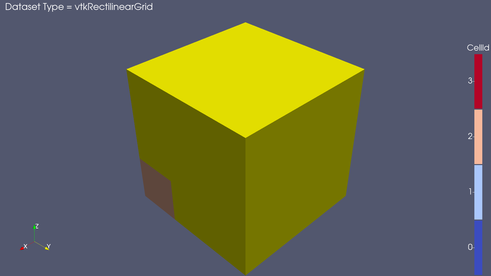

### Demo 3

```python
# Demo 3
import magnetovis as mvs
mvs.CreateViewAndLayout()
mvs.GridData(OutputDataSetType="vtkStructuredGrid")
mvs.SetTitle("Dataset Type = vtkStructuredGrid")

```


## LatLong (Source)

Source file: [LatLong.py](https://github.com/rweigel/magnetovis/tree/main/magnetovis/Sources/LatLong.py) | Demo file: [LatLong_demo.py](https://github.com/rweigel/magnetovis/tree/main/magnetovis/Sources/LatLong_demo.py)

### Demo 1

```python
# Demo 1
import magnetovis as mvs
mvs.SetOrientationAxisLabel()
mvs.Earth()
mvs.LatLong(coord_sys="GEO")
mvs.SetTitle()


```


### Demo 2

```python
# Demo 2
import magnetovis as mvs
mvs.CreateViewAndLayout()
mvs.SetOrientationAxisLabel(Text="GEO")
mvs.Earth(coord_sys="GEO", coord_sys_view="GEO")
mvs.LatLong(coord_sys="GEO", coord_sys_view="GEO")
mvs.SetTitle()


```


### Demo 3

```python
# Demo 3
import magnetovis as mvs
mvs.CreateViewAndLayout()
mvs.SetOrientationAxisLabel()
mvs.Earth()
mvs.LatLong(coord_sys="GEO")
mvs.SetTitle()
mvs.SetOrientationAxisLabel()
zAxis = mvs.Axis(direction="Z", coord_sys="GEO", extent=[-3, 3])
mvs.SetPresentationProperties(source=zAxis, 
    **{"label": {"source": {"Text": "$Z_{GEO}$"}}})


```

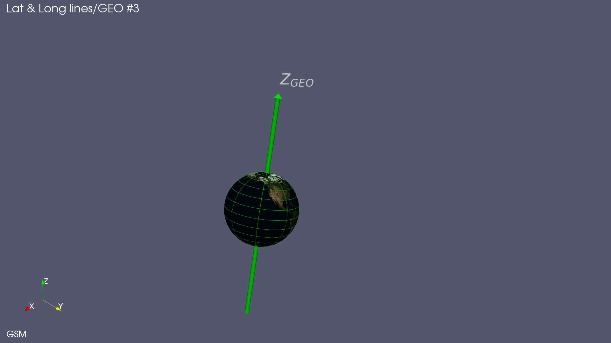

### Demo 4

```python
# Demo 4
import magnetovis as mvs
mvs.CreateViewAndLayout()
mvs.SetOrientationAxisLabel()
mvs.Earth()
mvs.LatLong(coord_sys="MAG")
mvs.SetTitle()
mvs.SetOrientationAxisLabel()
zAxis = mvs.Axis(direction="Z", coord_sys="MAG", extent=[-3, 3])
mvs.SetPresentationProperties(source=zAxis, 
    **{"label": {"source": {"Text": "$Z_{MAG}$"}}})

```

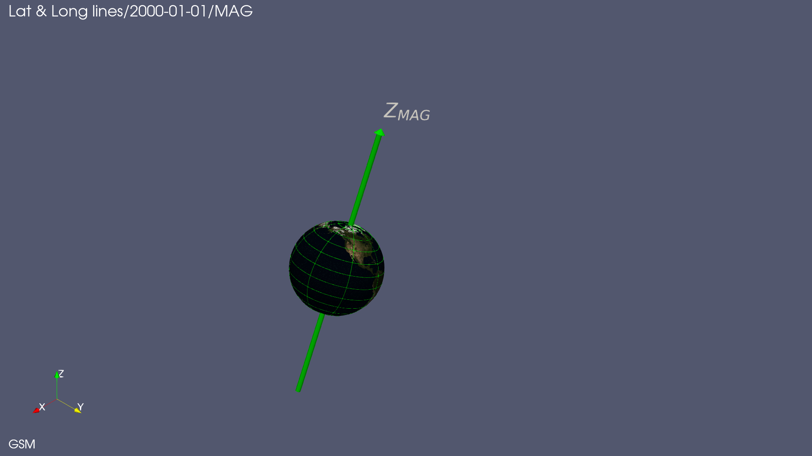

## Lines (Source)

Source file: [Lines.py](https://github.com/rweigel/magnetovis/tree/main/magnetovis/Sources/Lines.py) | Demo file: [Lines_demo.py](https://github.com/rweigel/magnetovis/tree/main/magnetovis/Sources/Lines_demo.py)

### Demo 1

```python
# Demo 1
import magnetovis as mvs
mvs.Lines()
#mvs.PrintSourceDefaults('Lines')
mvs.SetTitle("Line with default options")
#mvs.PrintPresentationDefaults('Lines', all=True)


```

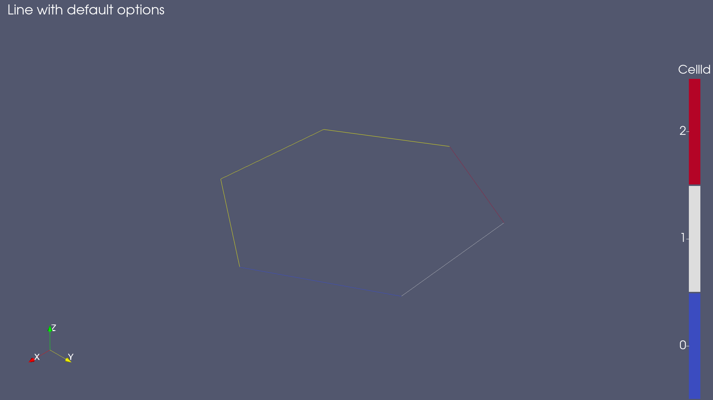

### Demo 2

```python
# Demo #2
import magnetovis as mvs
mvs.CreateViewAndLayout()

kwargs = {
            "time": "2001-01-01",
            "coord_sys": "GSM",
            "Nlines": 3,
            "closed": True,
            "point_function": "circle(radius=1.0, center=(0.0, 0.0, 0.0))"
        }

mvs.Lines(**kwargs)

```


## Plasmasphere (Source)

Source file: [Plasmasphere.py](https://github.com/rweigel/magnetovis/tree/main/magnetovis/Sources/Plasmasphere.py) | Demo file: [Plasmasphere_demo.py](https://github.com/rweigel/magnetovis/tree/main/magnetovis/Sources/Plasmasphere_demo.py)

### Demo 1

```python
# Demo 1
import magnetovis as mvs
plasmasphere = mvs.Plasmasphere()
mvs.SetTitle()
mvs.SetOrientationAxisLabel('GSM')


```


### Demo 2

```python
# Demo #2
import magnetovis as mvs
mvs.CreateViewAndLayout()
plasmasphere = mvs.Plasmasphere(coord_sys='SM', coord_sys_view='SM')
mvs.SetTitle()
mvs.Earth(coord_sys='SM', coord_sys_view='SM')
mvs.SetOrientationAxisLabel('SM')

# Add slice
import paraview.simple as pvs
pvs.Hide(plasmasphere)
slice1 = pvs.Slice(registrationName=' y=0 slice', Input=plasmasphere)
slice1.SliceType = 'Plane'
slice1.HyperTreeGridSlicer = 'Plane'
slice1.SliceOffsetValues = [0.0]
slice1.SliceType.Normal = [0.0, 1.0, 0.0]

renderView1 = pvs.GetActiveViewOrCreate('RenderView')
slice1Display = pvs.Show(slice1, renderView1, 'GeometryRepresentation')

# Show slice color bar
slice1Display.SetScalarBarVisibility(renderView1, True)
pvs.Hide3DWidgets(proxy=slice1.SliceType)

# Add countour
contour1 = pvs.Contour(registrationName='1.5 Contour', Input=slice1)
contour1.ContourBy = ['POINTS', 'H+ log density [cm^-3]']
contour1.Isosurfaces = [1.5]
contour1.PointMergeMethod = 'Uniform Binning'
pvs.Show(contour1)

color = [1.0, 0.0, 0.0]
tube = pvs.Tube(contour1)
pvs.Show(tube)
mvs.SetColor(color)

text = pvs.Text(Text='log(n) = 1.5')
pvs.Show(text, TextPropMode='Billboard 3D Text', BillboardPosition=[-5, 0.1, 0.0], Color=color)

mvs.SetCamera(viewType="-Y")


```


### Demo 3

```python
# Demo #3
import magnetovis as mvs
import paraview.simple as pvs
mvs.CreateViewAndLayout()
plasmasphere = mvs.Plasmasphere()
pvs.Hide(plasmasphere)
mvs.SetTitle("log$(n)=1.5$", source=plasmasphere)
mvs.Earth()
mvs.SetOrientationAxisLabel('GSM')

# Add slice
import paraview.simple as pvs

# Add countour
contour1 = pvs.Contour(registrationName='1.5 Contour', Input=plasmasphere)
contour1.ContourBy = ['POINTS', 'H+ log density [cm^-3]']
contour1.Isosurfaces = [1.5]
contour1.PointMergeMethod = 'Uniform Binning'
pvs.Hide3DWidgets(proxy=slice1.SliceType)

clip1 = pvs.Clip(registrationName='y=0 slice', Input=contour1)
clip1.ClipType = 'Plane'
clip1.Value = [0.0]
clip1.ClipType.Origin = [0.0, 1.0, 0.0]
clip1.ClipType.Normal = [0.0, 1.0, 0.0]
pvs.Hide3DWidgets(proxy=clip1.ClipType)
pvs.Show(clip1)
mvs.SetCamera(viewType="isometric")


```


## Satellite (Source)

Source file: [Satellite.py](https://github.com/rweigel/magnetovis/tree/main/magnetovis/Sources/Satellite.py) | Demo file: [Satellite_demo.py](https://github.com/rweigel/magnetovis/tree/main/magnetovis/Sources/Satellite_demo.py)

### Demo 1

```python
# Demo 1
import magnetovis as mvs
mvs.Satellite()


```


### Demo 2

```python
# Demo #2
import magnetovis as mvs
mvs.CreateViewAndLayout()
skwargs = {
	"start": "2010-01-04T00:00:00",
	"stop": "2010-01-05T00:00:00",
	"coord_sys": "GSM"
}
themisa = mvs.Satellite(id='themisa', **skwargs)
themisb = mvs.Satellite(id='themisb', **skwargs)

dkwargs = {
            "label":
                {
                    "source": {"Text": ""},
                    "display": {
                        "FontSize": 24,
                        "Color": [0.5, 0.5, 0.5]
                    }
                }
            }

dkwargs['label']['source']['Text'] = 'THEMIS A'
dkwargs['label']['display']['Color'] = [0, 0, 1]
mvs.SetPresentationProperties(source=themisa, **dkwargs)

dkwargs['label']['source']['Text'] = 'THEMIS B'
dkwargs['label']['display']['Color'] = [1, 0, 0]
mvs.SetPresentationProperties(source=themisb, **dkwargs)

mvs.SetCamera(Azimuth=45, Elevation=45)

mvs.SetTitle(mvs.util.trim_iso(skwargs["start"]) \
			+ " - " + mvs.util.trim_iso(skwargs["stop"]) \
			+ " " + skwargs["coord_sys"], registrationName="Title")

```


## T89c (Source)

Source file: [T89c.py](https://github.com/rweigel/magnetovis/tree/main/magnetovis/Sources/T89c.py) | Demo file: [T89c_demo.py](https://github.com/rweigel/magnetovis/tree/main/magnetovis/Sources/T89c_demo.py)

### Demo 1

```python
# Demo 1
import magnetovis as mvs
t89c = mvs.T89c(dimensions=[20, 20, 20])
mvs.SetTitle()


```

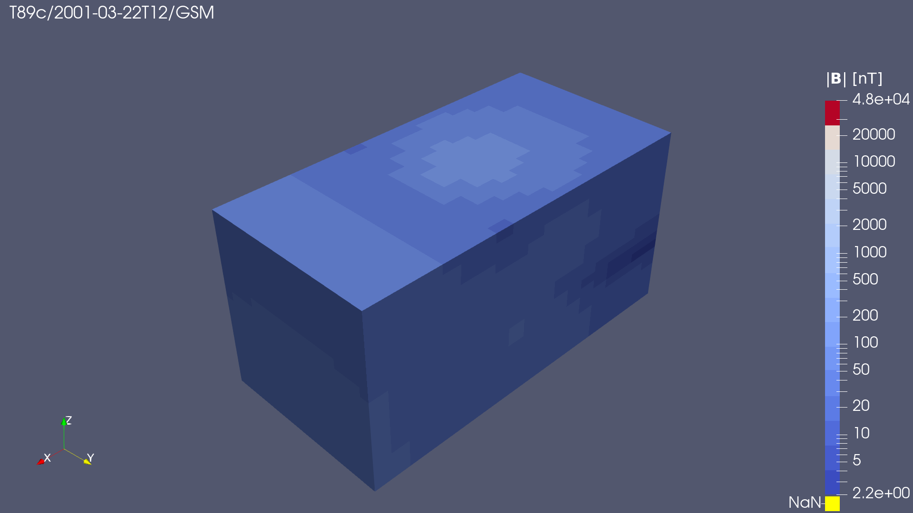

### Demo 2

```python
# Demo 2
import magnetovis as mvs
mvs.CreateViewAndLayout()
t89c = mvs.T89c(dimensions=[20, 20, 20])
mvs.SetTitle()

import paraview.simple as pvs
pvs.Hide(t89c)
streamTracer1 = pvs.StreamTracer(registrationName='StreamTracer1', Input=t89c, SeedType='Line')
streamTracer1.Vectors = ['POINTS', 'B']
streamTracer1.MaximumStreamlineLength = 20.0

# init the 'Line' selected for 'SeedType'
streamTracer1.SeedType.Point1 = [-10.0, 0.0, 0.0]
streamTracer1.SeedType.Point2 = [-2.0, 0.0, 0.0]
streamTracer1.SeedType.Resolution = 10

# set active source
pvs.SetActiveSource(streamTracer1)

# show data in view
streamTracer1Display = pvs.Show(streamTracer1)

```


## T95CurrentSheet (Source)

Source file: [T95CurrentSheet.py](https://github.com/rweigel/magnetovis/tree/main/magnetovis/Sources/T95CurrentSheet.py) | Demo file: [T95CurrentSheet_demo.py](https://github.com/rweigel/magnetovis/tree/main/magnetovis/Sources/T95CurrentSheet_demo.py)

### Demo 1

```python
# Execute using
#   magnetovis --script=T95CurrentSheet_demo.py

# Demo 1
import magnetovis as mvs
s = mvs.T95CurrentSheet()


```


## GridData (Plugin)

Source file: [GridData.py](https://github.com/rweigel/magnetovis/tree/main/magnetovis/Plugins/demos/GridData.py) | Demo file: [GridData_demo.py](https://github.com/rweigel/magnetovis/tree/main/magnetovis/Plugins/demos/GridData_demo.py)

### Demo 1

```python
# Demo 1
import paraview.simple as pvs
pvs.Text()
grid = pvs.MagnetovisGridData()
pvs.Show(grid, view=pvs.GetActiveView())

```

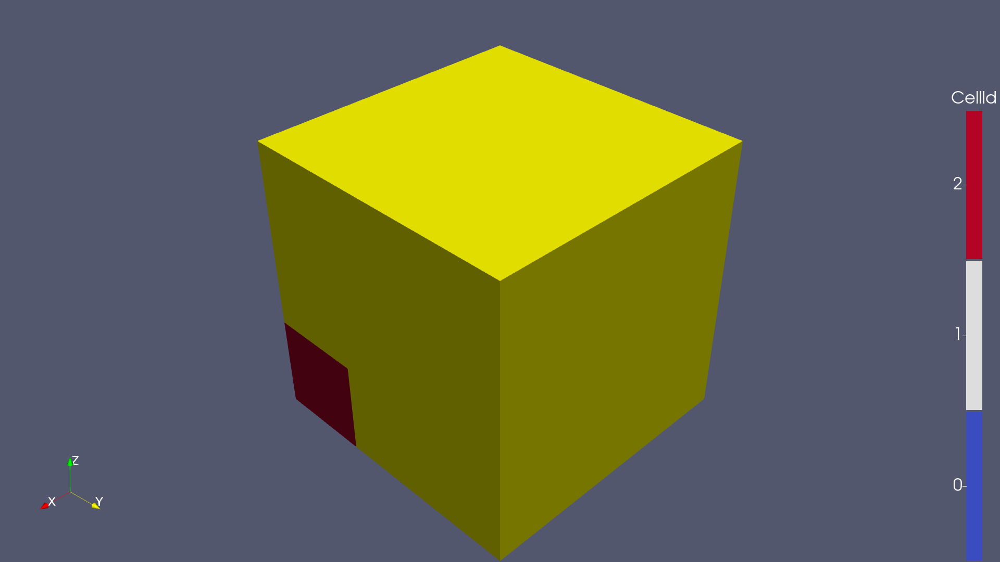

## CurveProbe (Filter)

Source file: [CurveProbe.py](https://github.com/rweigel/magnetovis/tree/main/magnetovis/Filters/CurveProbe.py) | Demo file: [CurveProbe_demo.py](https://github.com/rweigel/magnetovis/tree/main/magnetovis/Filters/CurveProbe_demo.py)

### Demo 1

```python
# Demo 1
import paraview.simple as pvs
import magnetovis as mvs
mvs.ClearPipeline()
grid = mvs.GridData()

mvs.SetRepresentation('Wireframe')
mvs.SetColor('blue')

# TODO:
#   1. Code that looks for number of unique values in SetTransferFunctionDefaults
#      should round numbers for annotations.
#   2. The coloring of the tube here is based on interpolation. Create
#      mvs.SegmentedTube() that gives a tube with uniform color for each
#      segment. 
line = pvs.Line(Point1=[0.9, 0.0, 0.0], Point2=[0.0, 0.9, 0.9], Resolution=3)
curve = mvs.CurveProbe(Input=[grid, line])
tube = pvs.Tube(Input=curve, Radius=0.01)
mvs.SetColoring(["POINTS", "xyz", "X"])
mvs.SetCamera(viewType='isometric')
```


## Fieldlines (Filter)

Source file: [Fieldlines.py](https://github.com/rweigel/magnetovis/tree/main/magnetovis/Filters/Fieldlines.py) | Demo file: [Fieldlines_demo.py](https://github.com/rweigel/magnetovis/tree/main/magnetovis/Filters/Fieldlines_demo.py)

### Demo 1

```python

# Demo 1
import paraview.simple as pvs
import magnetovis as mvs

mvs.ClearPipeline()
# grid = mvs.GridData()
# mvs.SetRepresentation('Wireframe')
# mvs.SetColor('blue')

from urllib.request import urlretrieve
url = 'http://mag.gmu.edu/git-data/swmfio/3d__var_2_e20190902-041000-000.vtk'
vtkfile = "/tmp/" + url.split("/")[-1]

import os
if not os.path.exists(vtkfile):
  print("Downloading " + url, flush=True)
  urlretrieve(url, vtkfile)

import magnetovis as mvs
batsrus = mvs.BATSRUS(file=vtkfile)

    
# find source
registrationName = list(pvs.GetSources().keys())\
    [list(pvs.GetSources().values()).index(pvs.GetActiveSource())][0]
batsrus_source = pvs.FindSource(registrationName)


mvs.SetTitle("Default")


line = pvs.Line(Point1=[-10.0, 0.0, 0.0], Point2=[-3, 0.0, 0.0], Resolution=9)

fieldlines = mvs.Fieldlines(Input=[batsrus_source, line])


```


## RotateUsingVectors (Filter)

Source file: [RotateUsingVectors.py](https://github.com/rweigel/magnetovis/tree/main/magnetovis/Filters/RotateUsingVectors.py) | Demo file: [RotateUsingVectors_demo.py](https://github.com/rweigel/magnetovis/tree/main/magnetovis/Filters/RotateUsingVectors_demo.py)

### Demo 1

```python

# Demo 1
import paraview.simple as pvs
import magnetovis as mvs
a = mvs.Axis()
# Vector1 rotated into Vector2 corresponds to a rotation of 45° around Z
cR = mvs.RotateUsingVectors(Input=a, Vector1=[1, 1, 0], Vector2=[0, 1, 0]) 
mvs.SetTitle()
pvs.Show(cR)
mvs.SetCamera(viewType="-Z")

```

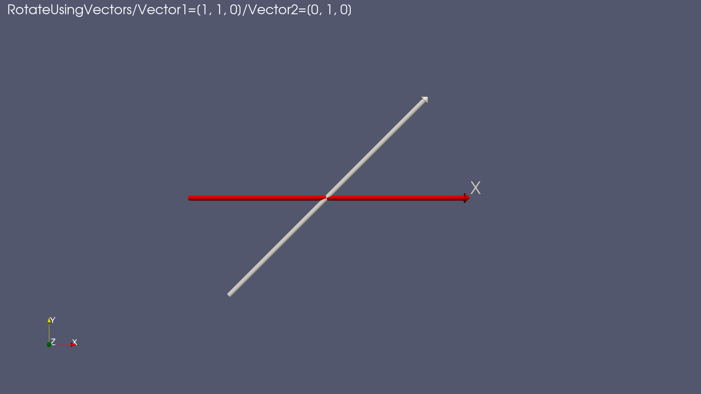

## Rotate (Filter)

Source file: [Rotate.py](https://github.com/rweigel/magnetovis/tree/main/magnetovis/Filters/Rotate.py) | Demo file: [Rotate_demo.py](https://github.com/rweigel/magnetovis/tree/main/magnetovis/Filters/Rotate_demo.py)

### Demo 1

```python
# Demo 1
import paraview.simple as pvs
import magnetovis as mvs
a = mvs.Axis()
# Default is to rotate around Z
cR = mvs.Rotate(Input=a, angle=90) 
pvs.Show(cR)
pvs.ResetCamera()


```

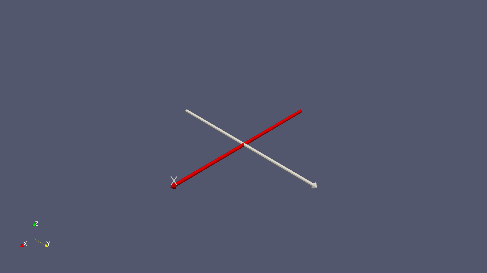

### Demo 2

```python
# Demo 2
import paraview.simple as pvs
import magnetovis as mvs
mvs.CreateViewAndLayout()
a = mvs.Axis()
aR = mvs.Rotate(Input=a, angle=90, axis="Y")
pvs.Show(aR)
pvs.ResetCamera()


```

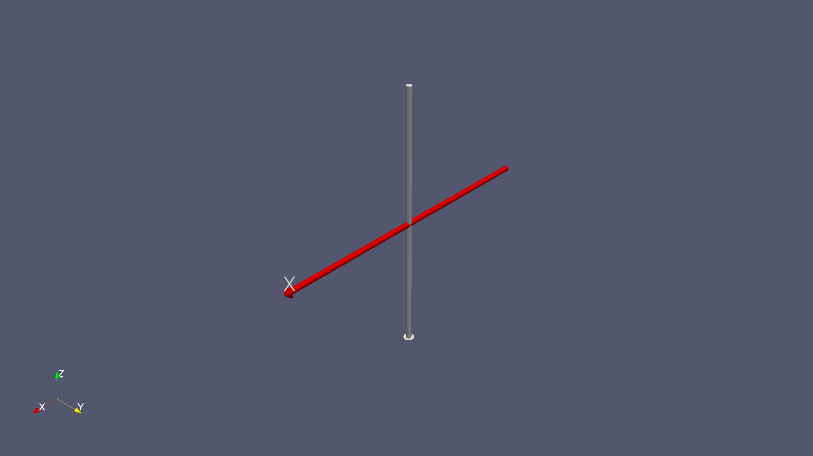

### Demo 3

```python
# Demo 3
import paraview.simple as pvs
import magnetovis as mvs
mvs.CreateViewAndLayout()
a = mvs.Axis()
aR = mvs.Rotate(Input=a, angle=89.999999, axis=[1, 1, 0])
pvs.Show(aR)
pvs.ResetCamera()

```

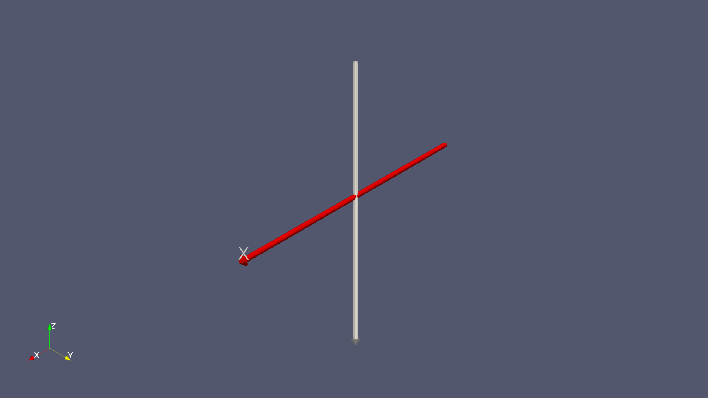

## Transform (Filter)

Source file: [Transform.py](https://github.com/rweigel/magnetovis/tree/main/magnetovis/Filters/Transform.py) | Demo file: [Transform_demo.py](https://github.com/rweigel/magnetovis/tree/main/magnetovis/Filters/Transform_demo.py)

### Demo 1

```python

# Demo 1
import paraview.simple as pvs
import magnetovis as mvs
earth = mvs.Earth(style="daynight")
pvs.Hide(earth)
earthT = mvs.Transform(x=[0, -1, 0], y=[1, 0, 0], Input=earth)
pvs.Show(earthT)
pvs.ResetCamera()


```


## NEZ (Script)

Source file: [NEZ.py](https://github.com/rweigel/magnetovis/tree/main/magnetovis/Demos/NEZ.py) | Demo file: [NEZ_demo.py](https://github.com/rweigel/magnetovis/tree/main/magnetovis/Demos/NEZ_demo.py)

### Demo 1

```python
# Demo 1
import paraview.simple as pvs
import magnetovis as mvs
import numpy as np

def nez(time, pos, csys):
  """Unit vectors in geographic north, east, and zenith dirs

    Given a cartesian position `pos` in `csys` at time `time`,
    returns the cartesian unit vectors for geographic north,
    east, and zenith in `csys`.

    Example:
      n_geo, e_geo, z_geo = nez("2010-01-01T00:00:00", (1, 0, 0), "GEO")
      print("North: {}".format(n_geo)) # North: [0. 0. 1.]
      print("East:  {}".format(e_geo)) # East:  [0. 1. 0.]
      print("Z:     {}".format(z_geo)) # Z:     [1. 0. 0.]
  """

  from hxform import hxform as hx

  # Geographic z axis in csys
  Z = hx.transform(np.array([0, 0, 1]), time, 'GEO', csys, lib='cxform')

  # zenith direction ("up")
  z_geo = pos/np.linalg.norm(pos)

  e_geo = np.cross(Z, z_geo)
  e_geo = e_geo/np.linalg.norm(e_geo)

  n_geo = np.cross(z_geo, e_geo)
  n_geo = n_geo/np.linalg.norm(n_geo)

  if False:
    print(f"Unit vectors for Geographic N, E, and Z at {pos} in {csys} at {time}:")
    print("North: {}".format(n_geo))
    print("East:  {}".format(e_geo))
    print("Z:     {}".format(z_geo))

  return n_geo, e_geo, z_geo

def showaxis(pos, n_geo, e_geo, z_geo, pos_label=""):

  def showlabel(dir,base,top):

    Label = pvs.Text(registrationName=dir+'_GEO Label', Text=dir+"$_{GEO}$")
    text1Display = pvs.Show(Label, pvs.GetActiveViewOrCreate('RenderView'), 'TextSourceRepresentation',
      TextPropMode='Flagpole Actor',BasePosition=base,TopPosition=top)

  north = pvs.Line(registrationName="  N_GEO Axis Line", Point1=pos, Point2=pos+n_geo)
  north_tube = pvs.Tube(north, registrationName="  N_GEO Axis Tube", Radius=0.02)
  mvs.SetColor('blue')
  pvs.Show(north_tube)
  showlabel('N', pos+n_geo, pos+1.05*n_geo)

  east = pvs.Line(registrationName="  E_GEO Axis Line", Point1=pos, Point2=pos+e_geo)
  east_tube = pvs.Tube(east, registrationName="  E_GEO Axis Tube", Radius=0.02)
  mvs.SetColor('green')
  pvs.Show(east_tube)
  showlabel('E', pos+e_geo, pos+e_geo+0.05*n_geo)

  up = pvs.Line(registrationName="  Z_GEO Axis Line", Point1=pos, Point2=pos+z_geo)
  up_tube = pvs.Tube(up, registrationName="  Z_GEO Axis Tube", Radius=0.02)
  mvs.SetColor('red')
  pvs.Show(up_tube)
  showlabel('Z', pos+z_geo, pos+z_geo+0.05*n_geo)

  s = pvs.Sphere(registrationName=pos_label, Radius=0.05, Center=pos)
  pvs.Show(s)


```


